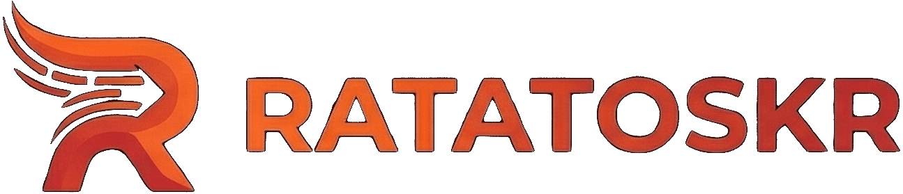

<p align="center">
  
</p>

# Ratatoskr

  A modern .NET library for reliable event/message publishing using the outbox pattern with CloudEvents support.

## Getting Started

### Quick Start with .NET Aspire

The easiest way to run the example application is using the .NET Aspire AppHost (Aspire CLI, not the obsolete Aspire workload).

```bash
aspire run
```

This starts PostgreSQL (logical databases `publisherdb`, `consumerdb`, `playgrounddb`), RabbitMQ, and the **PlaygroundHost** web app, plus the Aspire dashboard (often at http://localhost:15000).

See [examples/README.md](examples/README.md) for the full demo guide.

## Project Structure

- `src/Ratatoskr` - Core library
- `src/Ratatoskr.EfCore` - Entity Framework Core outbox/inbox implementation
- `src/Ratatoskr.RabbitMq` - RabbitMQ transport
- `examples/` - Playground (`PlaygroundHost` + AppHost)
- `examples/AppHost` - .NET Aspire orchestration
- `tests/Ratatoskr.Tests` - Integration and unit tests

## Testing

The project includes comprehensive tests using TUnit and TestContainers:

```bash
dotnet run --project tests/Ratatoskr.Tests -- --maximum-parallel-tests 10
dotnet run --project tests/PlaygroundHost.Tests -- --maximum-parallel-tests 4
```

- Integration tests with real PostgreSQL and RabbitMQ containers
- See [tests/TESTING.md](tests/TESTING.md) for detailed testing guide