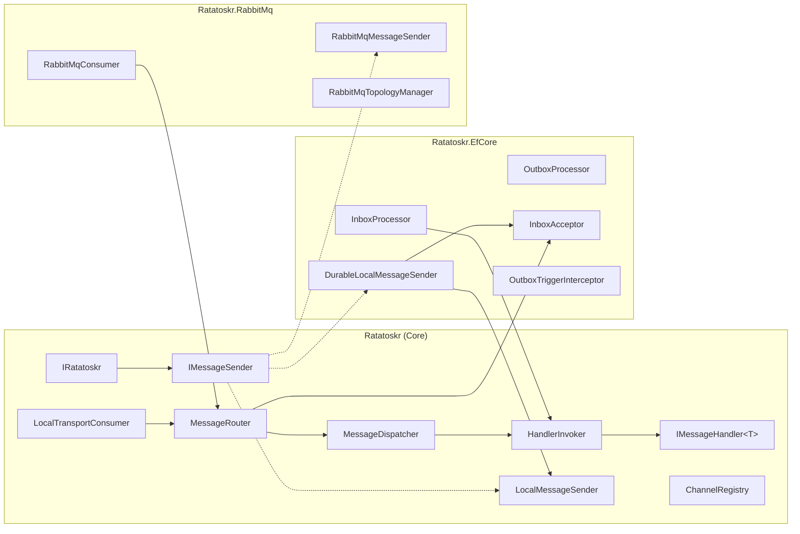
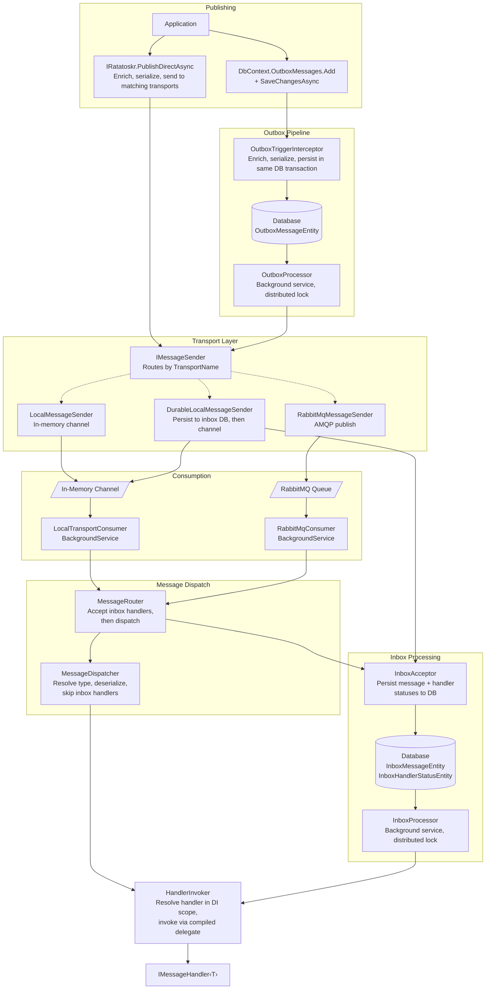
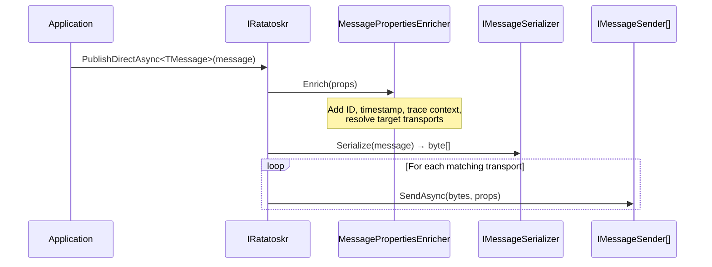
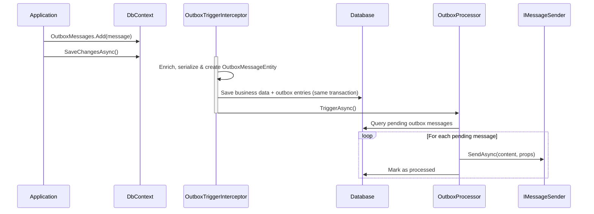
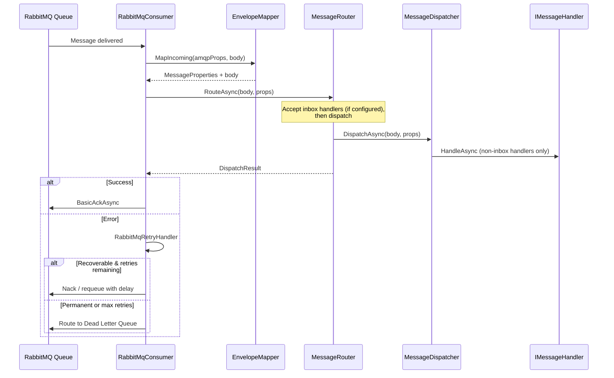
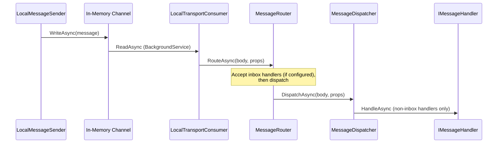
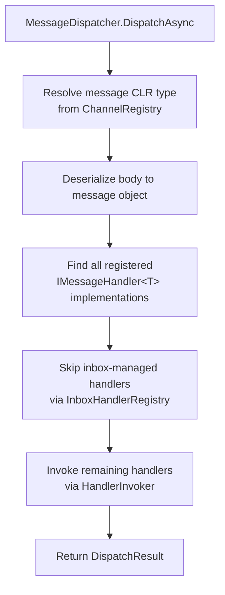
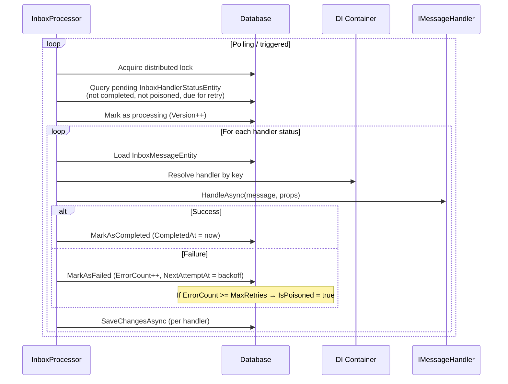
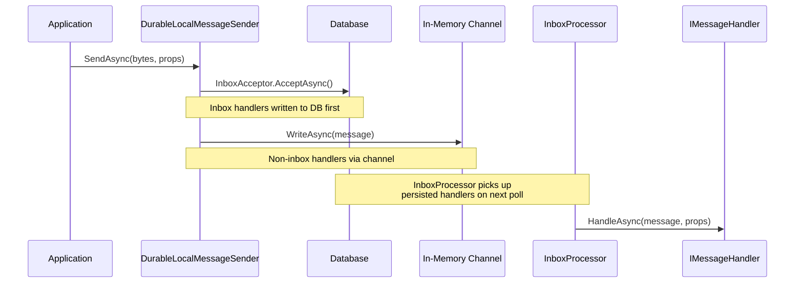

# Ratatoskr Architecture Guide

Ratatoskr is a lightweight CloudEvents bus implementation for .NET. It provides transport-agnostic message publishing and consumption with optional durability guarantees through the EF Core Outbox and Inbox patterns.

## Package Overview



The core library provides the abstractions (`IRatatoskr`, `IMessageSender`, `IMessageHandler<T>`, `MessageDispatcher`) and a built-in local (in-process) transport. The EfCore package adds outbox/inbox durability. The RabbitMq package provides a RabbitMQ transport.

---

## End-to-End Flow

The following diagram shows the complete message lifecycle — from publishing through transport to consumption and handler invocation. The sections below detail each step.



---

## Publishing

There are two ways to publish messages: directly via `IRatatoskr`, or transactionally via the EF Core Outbox.

### Direct Publishing



The application calls `IRatatoskr.PublishDirectAsync<T>()`. Ratatoskr enriches the message properties (CloudEvents ID, timestamp, trace context), serializes the message, then sends it to all `IMessageSender` implementations matching the configured transports.

### Transactional Publishing (EF Core Outbox)



Messages are added to the `DbContext` and persisted in the same database transaction as business data. The `OutboxTriggerInterceptor` hooks into EF Core's `SaveChangesAsync` to create `OutboxMessageEntity` records and signal the `OutboxProcessor`. The processor runs as a background service, acquires a distributed lock, and dispatches pending messages to the appropriate transport.

On failure, the outbox retries with exponential backoff. After exceeding the maximum retry count, the message is marked as poisoned.

---

## Consuming & Dispatch

All transports follow the same consumption path: messages are routed through the `MessageRouter` (which handles inbox acceptance) and then through the `MessageDispatcher`, which resolves handlers and invokes them.

### RabbitMQ Transport



On startup, `RabbitMqTopologyManager` provisions exchanges, queues, and bindings. The `RabbitMqConsumer` background service subscribes to configured queues. When a message arrives, the CloudEvents AMQP mapper extracts `MessageProperties` and the body from AMQP headers, then passes them to the `MessageRouter`.

The `MessageRouter` handles inbox acceptance (persisting inbox-managed handler statuses to the database if configured) and delegates to `MessageDispatcher` for non-inbox handler invocation. The consumer has no inbox awareness — it just calls `RouteAsync` and acts on the result. On errors, `RabbitMqRetryHandler` either requeues with a delay or routes to a Dead Letter Queue.

### Local Transport



The local transport uses an in-memory `System.Threading.Channels.Channel<T>`. `LocalMessageSender` writes to the channel, and `LocalTransportConsumer` (a `BackgroundService`) reads from it and routes messages through the `MessageRouter` — the same pipeline used by the RabbitMQ consumer. The router handles inbox acceptance (if configured) before delegating to `MessageDispatcher` for non-inbox handler invocation.

> **Note:** When `UseEfCoreInbox` and `UseLocalTransport` are both configured, the local sender is automatically replaced with `DurableLocalMessageSender`, which writes inbox entries to the database **before** writing to the in-memory channel. This means local publishes will have database-level latency and require database availability. See the [Inbox — Crash safety](inbox.md#crash-safety-local-transport) section for details.

### Message Dispatch



The `MessageDispatcher` resolves the message type from the `ChannelRegistry`, deserializes it, then delegates to `HandlerInvoker` for each non-inbox handler. Inbox-managed handlers are skipped — they have already been persisted to the database by the `InboxAcceptor` (called by the `MessageRouter` before dispatch) and will be delivered later by the `InboxProcessor`, which also uses `HandlerInvoker`.

If all handlers are inbox-managed, the dispatcher returns `NoHandlers`. The `MessageRouter` combines this with the `InboxAcceptor` result to determine the final outcome (treating it as success when inbox handlers were persisted).

---

## Inbox Pattern

The inbox provides per-handler durability, deduplication, and isolated retry. Each handler registered with a stable key gets its own database entry and is processed independently.

### Registration

Handlers opt into the inbox by providing a stable key:

```csharp
builder.AddHandler<OrderCreated, OrderCreatedHandler>(h =>
    h.WithInbox("order-created-handler"));
```

Without a key, the handler is fire-and-forget — invoked inline by the dispatcher without durability guarantees.

### Inbox Processing



The `InboxProcessor` runs as a background service with a distributed lock. It queries pending `InboxHandlerStatusEntity` records, claims them via optimistic concurrency (Version increment), and invokes each handler via the shared `HandlerInvoker` (same component used by `MessageDispatcher`). Progress is saved per handler — a failure in one handler does not affect others.

### Durable Local Transport

When both the local transport and inbox are enabled, `UseEfCoreInbox` automatically replaces the `LocalMessageSender` with `DurableLocalMessageSender`:



The durable sender delegates to `InboxAcceptor` to write inbox-managed handler statuses to the database **before** writing to the in-memory channel. This ensures crash safety: if the process dies after the DB write but before the channel write, the `InboxProcessor` still picks up the handlers on restart.

### Retry & Backoff

Both outbox and inbox use exponential backoff for failed messages:

```
NextAttemptAt = now + min(2^ErrorCount seconds, MaxRetryDelay)

Example with MaxRetryDelay = 5 min:
  Attempt 1 → retry after 2s
  Attempt 2 → retry after 4s
  Attempt 3 → retry after 8s
  Attempt 4 → retry after 16s
  ...
  Attempt 9+ → capped at 300s (5 min)
```

After exceeding the maximum retry count, the entry is marked as **poisoned** and no longer processed.

### Stuck Message Detection

If a handler has been in "processing" state longer than the configured threshold (default: 5 minutes), the `InboxProcessor` clears its `ProcessingStartedAt` field, making it eligible for retry. This handles cases where a worker crashes mid-processing.

---

## Database Schema

### Outbox

**`OutboxMessageEntity`** — one row per message per transport.

| Column | Description |
|---|---|
| `Id` | Primary key (GUID v7) |
| `Content` | Serialized message body |
| `SerializedProperties` | JSON-encoded MessageProperties |
| `TransportName` | Target transport |
| `CreatedAt` | When the message was staged |
| `ProcessedAt` | When successfully sent (null while pending) |
| `ProcessingStartedAt` | Set during processing, cleared on completion |
| `ErrorCount` | Number of failed attempts |
| `Error` | Last error message |
| `NextAttemptAt` | Exponential backoff timestamp |
| `IsPoisoned` | True after max retries exceeded |

### Inbox

**`InboxMessageEntity`** — one row per unique message (keyed by CloudEvents ID).

| Column | Description |
|---|---|
| `Id` | CloudEvents message ID (string, PK) |
| `TransportName` | Source transport |
| `Content` | Serialized message body |
| `SerializedProperties` | JSON-encoded MessageProperties |
| `ReceivedAt` | When the message was first received |

**`InboxHandlerStatusEntity`** — one row per handler per message.

| Column | Description |
|---|---|
| `Id` | Primary key (GUID v7) |
| `MessageId` | FK → InboxMessageEntity.Id |
| `HandlerKey` | Stable handler key (unique with MessageId) |
| `ErrorCount` | Number of failed attempts |
| `LastError` | Last error message |
| `ProcessingStartedAt` | Set during processing, cleared on completion |
| `NextAttemptAt` | Exponential backoff timestamp |
| `IsPoisoned` | True after max retries exceeded |
| `CompletedAt` | When successfully handled (null while pending) |
| `Version` | Optimistic concurrency token |

The unique constraint on `(MessageId, HandlerKey)` provides deduplication — concurrent delivery of the same message safely resolves via constraint violation.

---

## Concurrency & Distribution

Ratatoskr is designed for multi-instance deployment:

- **Distributed locks** (via Medallion.Threading) — Both `OutboxProcessor` and `InboxProcessor` acquire a named lock before processing. Only one instance processes at a time.
- **Optimistic concurrency** — `InboxHandlerStatusEntity.Version` prevents two workers from processing the same handler status simultaneously.
- **Idempotent persistence** — The inbox acceptor uses unique constraints for deduplication. Concurrent inserts safely resolve via constraint violations.

---

## Observability

Ratatoskr integrates with OpenTelemetry via `System.Diagnostics.Activity`:

- **Publishing** — Injects W3C trace context (`TraceParent`, `TraceState`) into message properties and transport headers.
- **Consuming** — Extracts trace context to continue the distributed trace.
- **Metrics** — Records receive lag, process duration, and message counts, tagged with messaging semantic conventions (`messaging.system`, `messaging.destination.name`).

### Message Activity Observers

`IMessageActivityObserver` implementations are notified at various pipeline stages (`Published`, `Received`, `Dispatched`, `OutboxStaged`, `OutboxSent`, `InboxQueued`, `InboxDispatched`, `InboxPoisoned`). Observers are designed for **testing and instrumentation** — they are not a mechanism for reliable side effects:

- Observer exceptions are always caught and logged at `Warning` level. They never affect the message pipeline.
- If an observer throws, the message is still processed normally.

Use `Ratatoskr.Testing`'s `MessageTrackingSession` (which is backed by an observer) for asserting message flow in integration tests.

---

## Message Schema Evolution

Ratatoskr uses `System.Text.Json` for message serialization. By default:

- New fields added to a message type will deserialize as `default` for in-flight messages that don't contain them.
- Removed fields in new code will be silently ignored during deserialization of old messages.
- Renamed fields will appear as new fields (old data lost).

**Recommendations:**

- Only add fields (additive changes). Never rename or remove fields that may exist in in-flight outbox/inbox messages.
- For breaking changes, introduce a new message type and migrate consumers before producers.
- Consider using a `SchemaVersion` CloudEvents extension attribute for future compatibility checks.
