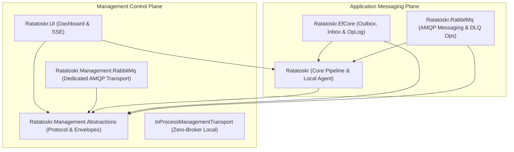
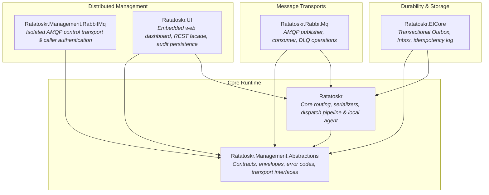

# Architecture Overview

Ratatoskr is an event-driven messaging framework for .NET designed around a **dual-plane architecture**: a high-throughput **Application Messaging Plane** for asynchronous event and command processing, and an isolated, transport-neutral **Management Control Plane** for fleet observability, queue triage, and operational control.

---

## The Dual-Plane Architecture

| Dimension | Application Messaging Plane | Management Control Plane |
|---|---|---|
| **Primary Goal** | High-throughput, durable asynchronous message publishing, routing, and consumption. | Fleet inspection, health monitoring, poisoned message triage, and DLQ remediation. |
| **Traffic Characteristics** | Continuous streaming, high volume, transactional database commits. | Ad-hoc RPC commands, heartbeats, low-latency REST and Server-Sent Events (SSE). |
| **Fault Isolation** | Runs over primary application brokers and DbContext instances. | Dedicated broker connections and channels. Continues operating even if application queues are stalled. |
| **Core Abstractions** | `IRatatoskr`, `IMessageSender`, `IMessageHandler<T>`, `InboxProcessor`, `OutboxProcessor`. | `ManagementAgent`, `IManagementDispatcher`, `IManagementTransport`, `ServiceRegistry`. |
| **Deep Dive** | [Messaging Pipeline Architecture](messaging-architecture.md) | [Management & Control Plane Architecture](management-architecture.md) |

---

## Package Graph & Responsibilities

Ratatoskr is split into 6 focused packages, allowing applications to deploy only the capabilities they require:

### 1. `Ratatoskr.Management.Abstractions`
The zero-dependency contract layer:
- Versioned RPC envelopes (`ManagementRequestEnvelope`, `ManagementResponseEnvelope`).
- Service discovery and topology models (`ServiceAnnouncement`, `ChannelTopology`, `QueueTopology`).
- Stable protocol error codes (`ManagementErrorCodes`) and wire JSON serialization (`ManagementJson`).
- Transport interfaces (`IManagementTransport`, `IManagementDiscoverySource`, `IManagementOperation`).

### 2. `Ratatoskr` (Core)
The foundational runtime library:
- Message routing pipeline (`MessageRouter`, `MessageDispatcher`, `HandlerInvoker`).
- Channel topology registry (`ChannelRegistry`).
- CloudEvents enrichment, metadata mapping, and serialization resolvers.
- The built-in `ManagementAgent`, local `ManagementDispatcher`, in-memory `ServiceRegistry`, and shared REST route generators (`ManagementApiRoutes`).
- Zero-broker `InProcessManagementTransport` for local monoliths and automated tests.

### 3. `Ratatoskr.EfCore`
Database durability for EF Core:
- **Application Durability**: Interceptor-based Transactional Outbox (`OutboxTriggerInterceptor`, `OutboxProcessor`), deduplicating Inbox (`InboxAcceptor`, `InboxProcessor`), and distributed locks.
- **Control Plane Operations**: Inbox and Outbox inspection, keyset pagination, and the atomic `ManagementOperationLog` idempotency engine.

### 4. `Ratatoskr.RabbitMq`
AMQP messaging transport:
- High-throughput message publisher and concurrent consumer background services.
- Dynamic topology provisioning (exchanges, durable queues, bindings).
- Control plane operations for inspecting queue depths, Dead Letter Queue (DLQ) batch requeueing, and DLQ purging (`RabbitMqDlqOperations`).

### 5. `Ratatoskr.Management.RabbitMq`
Distributed AMQP control plane provider:
- Dedicated broker connection independent of application messaging traffic.
- Least-privilege AMQP topology (`*.inbox` exchanges, durable service queues, exclusive instance and reply queues).
- Caller authentication via broker-validated `user_id` and optional HMAC SHA-256 signatures.

### 6. `Ratatoskr.UI`
Embedded web dashboard and management host:
- REST API facade and Server-Sent Events (SSE) stream (`/api/events`).
- Embedded vanilla ES module frontend (zero npm, zero build step, strict CSP, stored-XSS immune).
- Persistent snapshot hydration (`DashboardServiceStore`) and long-term audit trail storage (`RatatoskrDashboardDbContext`).

---

## Architectural Guarantees

### At-Least-Once Delivery
Both the messaging plane and the control plane operate under **at-least-once delivery** semantics:
- The **Outbox** guarantees that staged application messages will eventually be published, even across crashes and database restarts.
- The **Inbox** guarantees that each registered message handler executes at least once per message, tracking retries independently.
- The **Control Plane** uses persistent operation IDs (`ManagementOperationLog`) so retrying a management mutation returns the cached result without repeating the mutation.

### Separation of Transport vs. Durability
Ratatoskr strictly distinguishes between **moving** messages and **persisting** messages:
- **Transport** (`Ratatoskr.RabbitMq`, `Ratatoskr.EfCore`) carries serialized payloads across network or in-memory boundaries.
- **Durability** (`Ratatoskr.EfCore`) persists messages in a database to survive service outages and process crashes.

You can combine RabbitMQ transport with EF Core durability (Outbox + Inbox), or run direct transport-only publishing without database staging.

### Multi-Instance Concurrency & Isolation
Ratatoskr is designed from the ground up for containerized, scaled-out microservices:
- **Distributed Locks**: Background processors (`OutboxProcessor`, `InboxProcessor`) acquire named distributed locks (via Medallion.Threading) to prevent contention.
- **Optimistic Concurrency**: Entity `Version` columns prevent concurrent workers from processing the same row simultaneously.
- **Targeting Modes**: Management requests can target a logical service (competing across live replicas) or a specific named container instance (routing directly to an exclusive per-replica queue).

---

## Architecture Deep Dives

To learn more about the internal mechanics of each plane, explore the detailed architectural guides:

  

    

      

        <h4 class="card-title">📨 <a href="messaging-architecture.md">Messaging Pipeline Architecture</a></h4>
        

          Explore the complete lifecycle of application messages: direct publishing, transactional outbox triggers, RabbitMQ consumers, message routing, per-handler inbox execution, delivery guarantees, and concurrency controls.
        

      

    

  

  

    

      

        <h4 class="card-title">🐿️ <a href="management-architecture.md">Management &amp; Control Plane Architecture</a></h4>
        

          Deep dive into the management subsystem: 4-tier identity hierarchy, monotonic service discovery, RPC wire protocol, atomic idempotency engine, bounded bulk operations, DLQ triage, and the zero-npm web dashboard.
        

      

    

  

---

## Related Documentation

- [Getting Started](getting-started.md) — Quick start tutorial for building your first Ratatoskr service
- [Messages & Handlers](messages-handlers.md) — Designing message contracts and implementing handlers
- [Channels & Routing](channels-routing.md) — Logical channels, topic routing, and transport bindings
- [Transactional Outbox](outbox.md) — Complete outbox configuration and retry patterns
- [Deduplicating Inbox](inbox.md) — Per-handler durability and poison message management
- [Management UI and Control Plane](management-ui.md) — Operational setup and dashboard configuration guide
- [Management HTTP API Reference](management-api.md) — REST API endpoint reference
