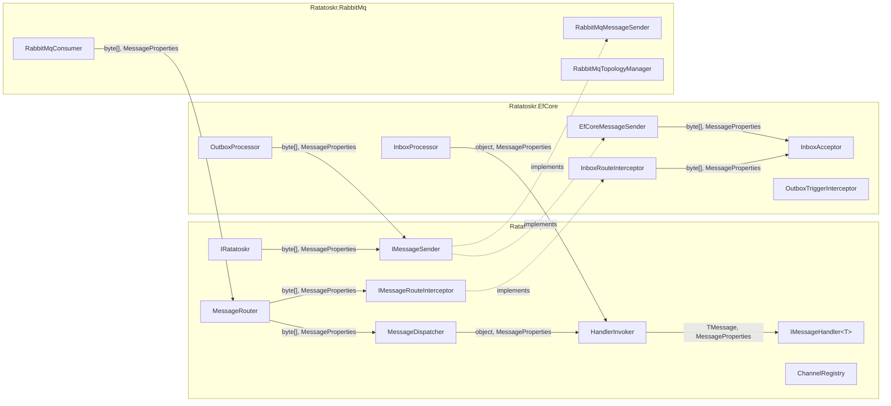
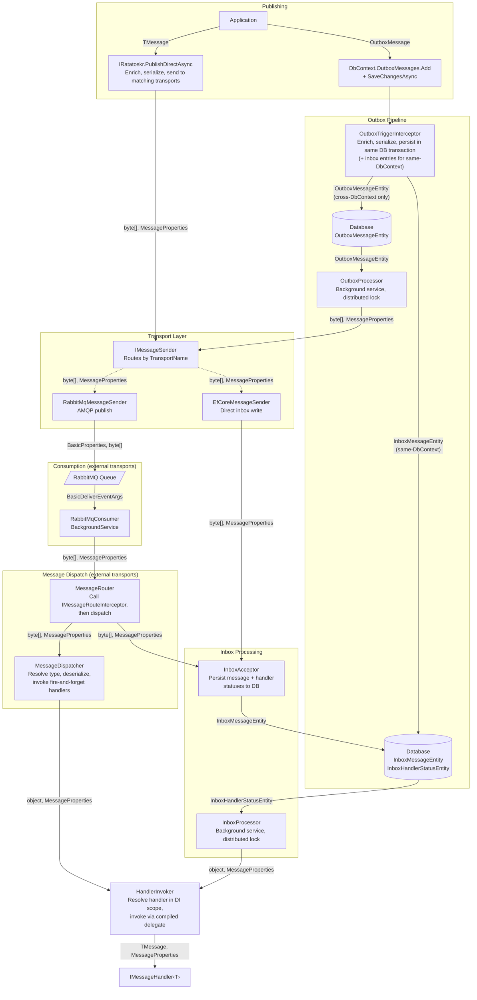
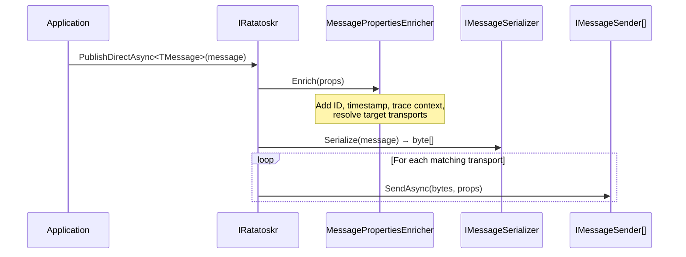
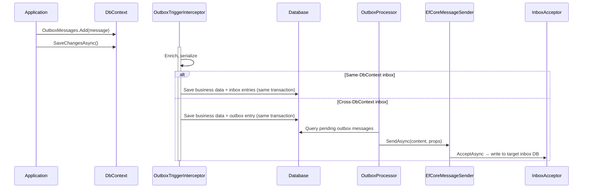
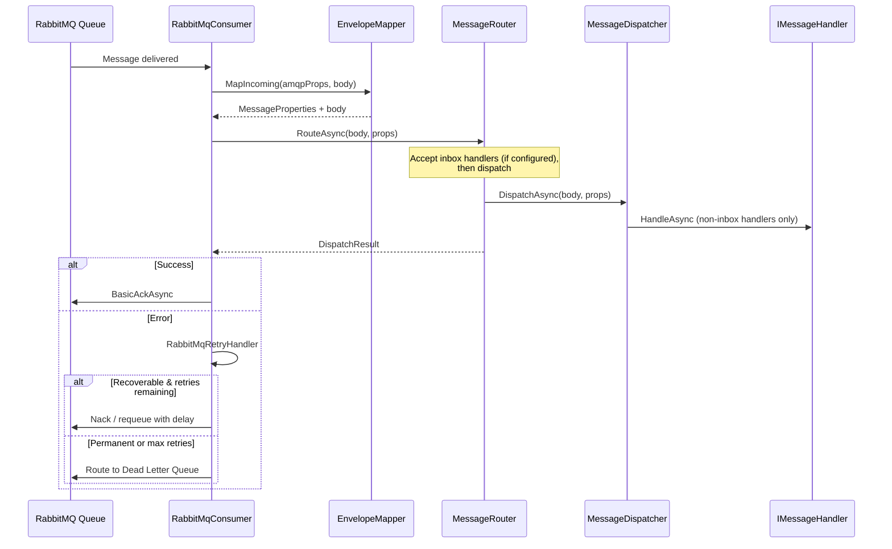
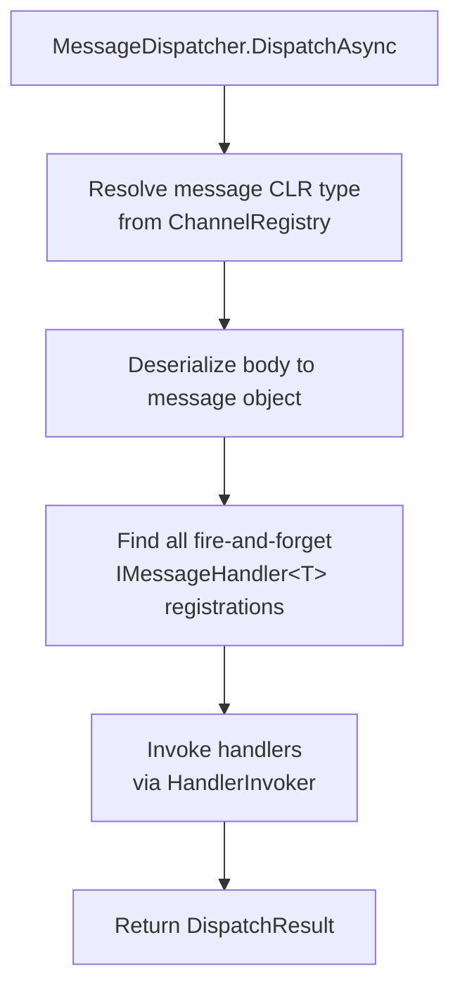
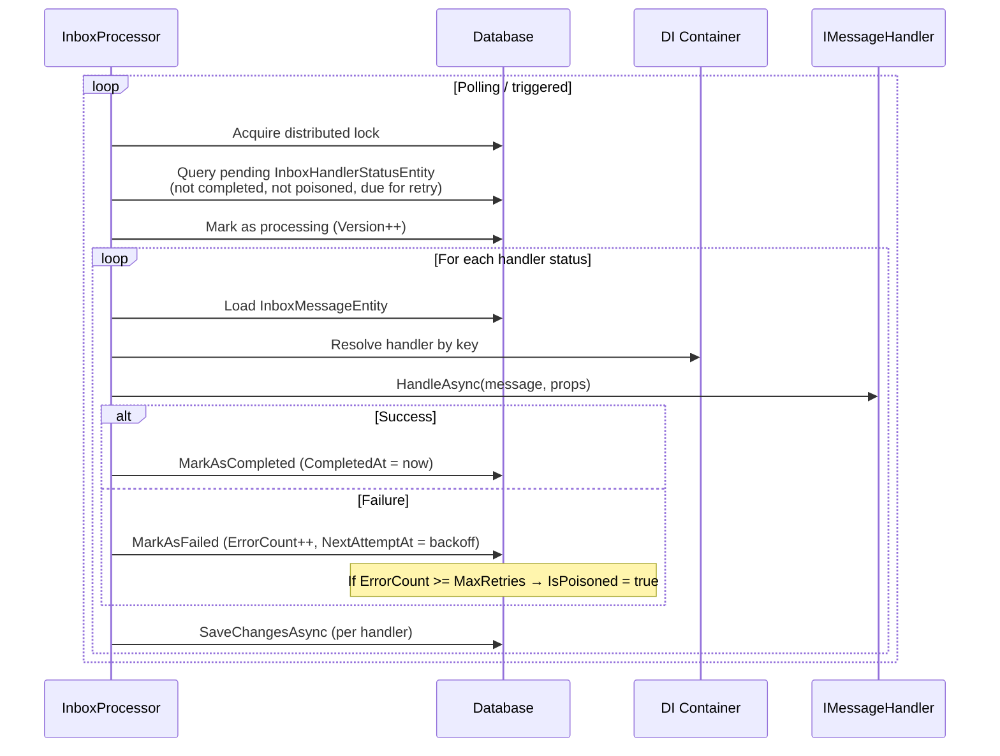
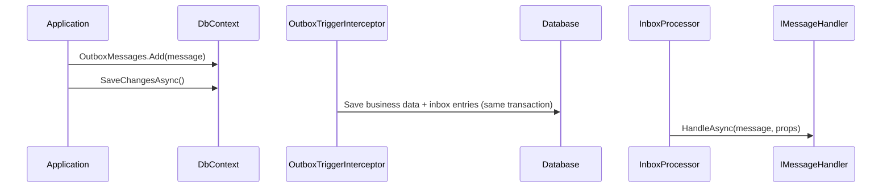

# Ratatoskr Architecture Guide

Ratatoskr is a lightweight CloudEvents bus implementation for .NET. It provides transport-agnostic message publishing and consumption with optional durability guarantees through the EF Core Outbox and Inbox patterns.

## Package Overview



The core library provides the abstractions (`IRatatoskr`, `IMessageSender`, `IMessageHandler<T>`, `MessageDispatcher`) and the message routing pipeline. The EfCore package adds the EF Core transport (durable in-process messaging via inbox tables) and outbox/inbox durability. The RabbitMq package provides a RabbitMQ transport. Handlers are registered per message type inside the channel's `Consumes<T>()` builder, and inbox support is enabled per consume channel via `UseInbox<TDbContext>()`.

---

## End-to-End Flow

The following diagram shows the complete message lifecycle — from publishing through transport to consumption and handler invocation. The sections below detail each step.



---

## Publishing

There are two ways to publish messages: directly via `IRatatoskr`, or transactionally via the EF Core Outbox.

### Direct Publishing



The application calls `IRatatoskr.PublishDirectAsync<T>()`. Ratatoskr enriches the message properties (CloudEvents ID, timestamp, trace context), serializes the message, then sends it to all `IMessageSender` implementations matching the configured transports. For the EF Core transport, `EfCoreMessageSender` writes directly to the inbox tables via `InboxAcceptor`.

### Transactional Publishing (EF Core Outbox)



Messages are added to the `DbContext` and persisted in the same database transaction as business data. The `OutboxTriggerInterceptor` hooks into EF Core's `SaveChangesAsync` to handle the message:

- **Same-DbContext:** Inbox entries (message + handler statuses) are created directly in the same transaction. No outbox entry is needed — the inbox processor picks them up immediately.
- **Cross-DbContext:** An `OutboxMessageEntity` is created. The `OutboxProcessor` background service dispatches it via `EfCoreMessageSender`, which writes to the target DbContext's inbox tables.

On failure, the outbox retries with exponential backoff. After exceeding the maximum retry count, the message is marked as poisoned.

---

## Consuming & Dispatch

### EF Core Transport

The EF Core transport writes messages directly to inbox tables — there is no in-memory channel or consumer loop. Messages flow through `EfCoreMessageSender` → `InboxAcceptor` → database → `InboxProcessor` → handler.

### RabbitMQ Transport



On startup, `RabbitMqTopologyManager` provisions exchanges, queues, and bindings. The `RabbitMqConsumer` background service subscribes to configured queues. When a message arrives, the CloudEvents AMQP mapper extracts `MessageProperties` and the body from AMQP headers, then passes them to the `MessageRouter`.

The `MessageRouter` calls the `IMessageRouteInterceptor` (if registered) to handle inbox acceptance, then delegates to `MessageDispatcher` for non-inbox handler invocation. The consumer has no inbox awareness — it just calls `RouteAsync` and acts on the result. On errors, `RabbitMqRetryHandler` either requeues with a delay or routes to a Dead Letter Queue.

### Message Dispatch



The `MessageDispatcher` resolves the message type from the `ChannelRegistry`, deserializes it, then delegates to `HandlerInvoker` for each fire-and-forget handler registered on the channel. Inbox-managed handlers are not part of the dispatcher's pipeline — they have already been persisted to the database by the `InboxAcceptor` and will be delivered later by the `InboxProcessor`, which also uses `HandlerInvoker`.

If there are no fire-and-forget handlers, the dispatcher returns `NoHandlers`. The `MessageRouter` combines this with the interceptor result to determine the outcome (treating it as success when the interceptor accepted inbox handlers).

---

## Inbox Pattern

The inbox provides per-handler durability, deduplication, and isolated retry. Each handler registered with a stable key gets its own database entry and is processed independently.

### Registration

Handlers are registered inside the channel's `Consumes<T>()` builder. Inbox handlers provide a stable key:

```csharp
bus.AddEventPublishChannel("events", c => c.WithEfCore().Produces<OrderCreated>());
bus.AddEventConsumeChannel("events", c => c
    .Consumes<OrderCreated>(m => m
        .WithHandler<FulfillmentHandler>("fulfillment"))
    .UseInbox<AppDbContext>());
```

With a key, the handler is inbox-managed — persisted to the database and delivered by `InboxProcessor`.

### Inbox Processing



The `InboxProcessor` runs as a background service with a distributed lock. It queries pending `InboxHandlerStatusEntity` records, claims them via optimistic concurrency (Version increment), and invokes each handler via the shared `HandlerInvoker` (same component used by `MessageDispatcher`). Progress is saved per handler — a failure in one handler does not affect others.

### Same-DbContext Optimization

When the outbox and inbox share the same `DbContext`, the `OutboxTriggerInterceptor` writes inbox entries (message + handler statuses) in the **same database transaction** as business data. No outbox entry is created — the inbox processor picks up the entries directly. This provides full crash safety with zero indirection:



For cross-DbContext scenarios, an outbox entry is created and the `OutboxProcessor` delivers the message to the target inbox via `EfCoreMessageSender`.

### Retry & Backoff

Both outbox and inbox use exponential backoff for failed messages:

```
NextAttemptAt = now + min(2^ErrorCount seconds, MaxRetryDelay)

Example with MaxRetryDelay = 5 min:
  Attempt 1 → retry after 2s
  Attempt 2 → retry after 4s
  Attempt 3 → retry after 8s
  Attempt 4 → retry after 16s
  ...
  Attempt 9+ → capped at 300s (5 min)
```

After exceeding the maximum retry count, the entry is marked as **poisoned** and no longer processed.

### Stuck Message Detection

If a handler has been in "processing" state longer than the configured threshold (default: 5 minutes), the `InboxProcessor` clears its `ProcessingStartedAt` field, making it eligible for retry. This handles cases where a worker crashes mid-processing.

---

## Database Schema

### Outbox

**`OutboxMessageEntity`** — one row per message per transport.

| Column | Description |
|---|---|
| `Id` | Primary key (GUID v7) |
| `Content` | Serialized message body |
| `SerializedProperties` | JSON-encoded MessageProperties |
| `TransportName` | Target transport |
| `CreatedAt` | When the message was staged |
| `ProcessedAt` | When successfully sent (null while pending) |
| `ProcessingStartedAt` | Set during processing, cleared on completion |
| `ErrorCount` | Number of failed attempts |
| `Error` | Last error message |
| `NextAttemptAt` | Exponential backoff timestamp |
| `IsPoisoned` | True after max retries exceeded |
| `Version` | Optimistic concurrency token |

### Inbox

**`InboxMessageEntity`** — one row per unique message (keyed by CloudEvents ID).

| Column | Description |
|---|---|
| `Id` | CloudEvents message ID (string, PK) |
| `TransportName` | Source transport |
| `Content` | Serialized message body |
| `SerializedProperties` | JSON-encoded MessageProperties |
| `ReceivedAt` | When the message was first received |

**`InboxHandlerStatusEntity`** — one row per handler per message.

| Column | Description |
|---|---|
| `Id` | Primary key (GUID v7) |
| `MessageId` | FK → InboxMessageEntity.Id |
| `HandlerKey` | Stable handler key (unique with MessageId) |
| `ErrorCount` | Number of failed attempts |
| `LastError` | Last error message |
| `ProcessingStartedAt` | Set during processing, cleared on completion |
| `NextAttemptAt` | Exponential backoff timestamp |
| `IsPoisoned` | True after max retries exceeded |
| `CompletedAt` | When successfully handled (null while pending) |
| `Version` | Optimistic concurrency token |

The unique constraint on `(MessageId, HandlerKey)` provides deduplication — concurrent delivery of the same message safely resolves via constraint violation.

---

## Concurrency & Distribution

Ratatoskr is designed for multi-instance deployment:

- **Distributed locks** (via Medallion.Threading) — Both `OutboxProcessor` and `InboxProcessor` acquire a named lock before processing. Only one instance processes at a time. Lock names are auto-generated per DbContext type (e.g. `InboxProcessor_OrdersDbContext`) to avoid collisions.
- **Optimistic concurrency** — Both `OutboxMessageEntity.Version` and `InboxHandlerStatusEntity.Version` prevent two workers from processing the same message or handler status simultaneously.
- **Idempotent persistence** — The inbox acceptor uses unique constraints for deduplication. Concurrent inserts safely resolve via constraint violations.
- **Multi-DbContext isolation** — Each `DbContext` type gets its own processor, lock, and options. Different channels can use different `DbContext` types for bounded context isolation. Per-DbContext services are registered once (idempotent across channels sharing a `DbContext`).

---

## Observability

Ratatoskr integrates with OpenTelemetry via `System.Diagnostics.Activity`:

- **Publishing** — Injects W3C trace context (`TraceParent`, `TraceState`) into message properties and transport headers.
- **Consuming** — Extracts trace context to continue the distributed trace.
- **Metrics** — Records receive lag, process duration, and message counts, tagged with messaging semantic conventions (`messaging.system`, `messaging.destination.name`).

### Message Activity Observers

`IMessageActivityObserver` implementations are notified at various pipeline stages (`Published`, `Received`, `Dispatched`, `OutboxStaged`, `OutboxSent`, `OutboxPoisoned`, `InboxQueued`, `InboxDispatched`, `InboxPoisoned`). Observers are designed for **testing and instrumentation** — they are not a mechanism for reliable side effects:

- Observer exceptions are always caught and logged at `Warning` level. They never affect the message pipeline.
- If an observer throws, the message is still processed normally.

Use `Ratatoskr.Testing`'s `MessageTrackingSession` (which is backed by an observer) for asserting message flow in integration tests.

---

## Message Schema Evolution

Ratatoskr uses `System.Text.Json` for message serialization. By default:

- New fields added to a message type will deserialize as `default` for in-flight messages that don't contain them.
- Removed fields in new code will be silently ignored during deserialization of old messages.
- Renamed fields will appear as new fields (old data lost).

**Recommendations:**

- Only add fields (additive changes). Never rename or remove fields that may exist in in-flight outbox/inbox messages.
- For breaking changes, introduce a new message type and migrate consumers before producers.
- Consider using a `SchemaVersion` CloudEvents extension attribute for future compatibility checks.
