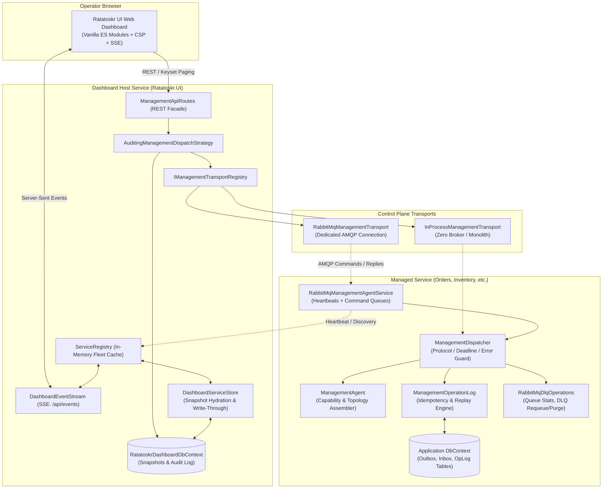
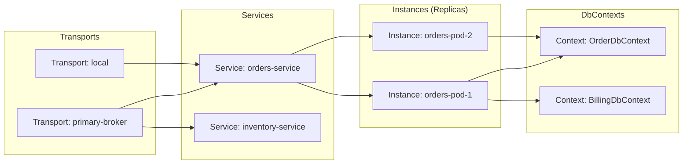
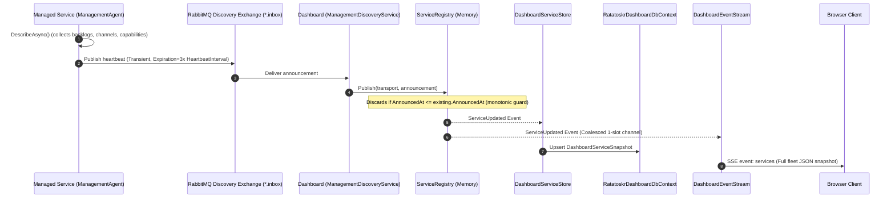
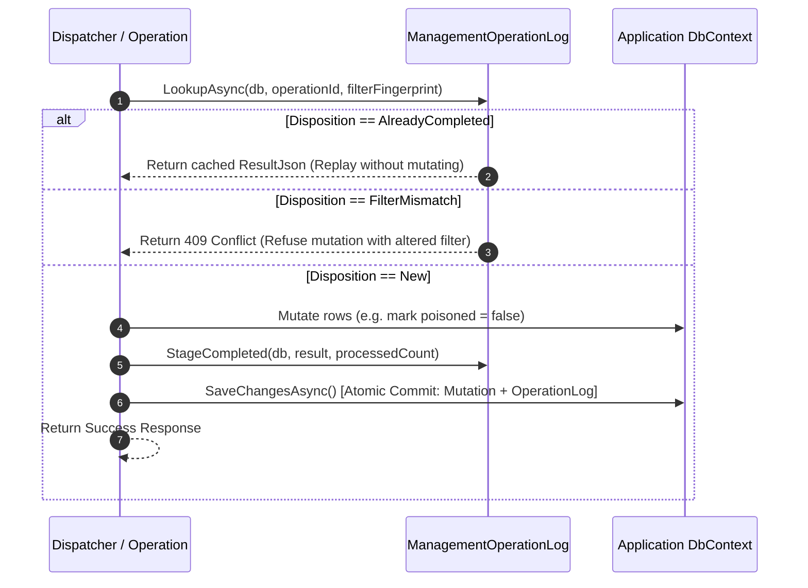
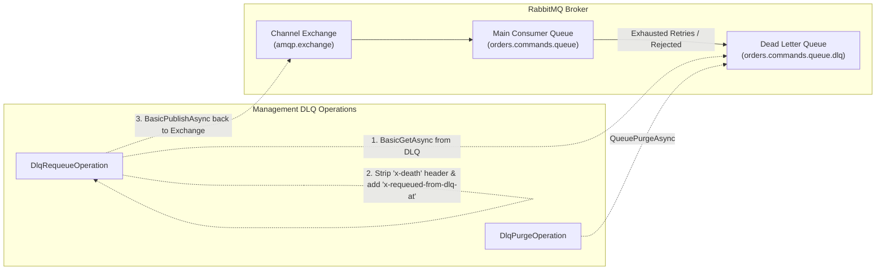
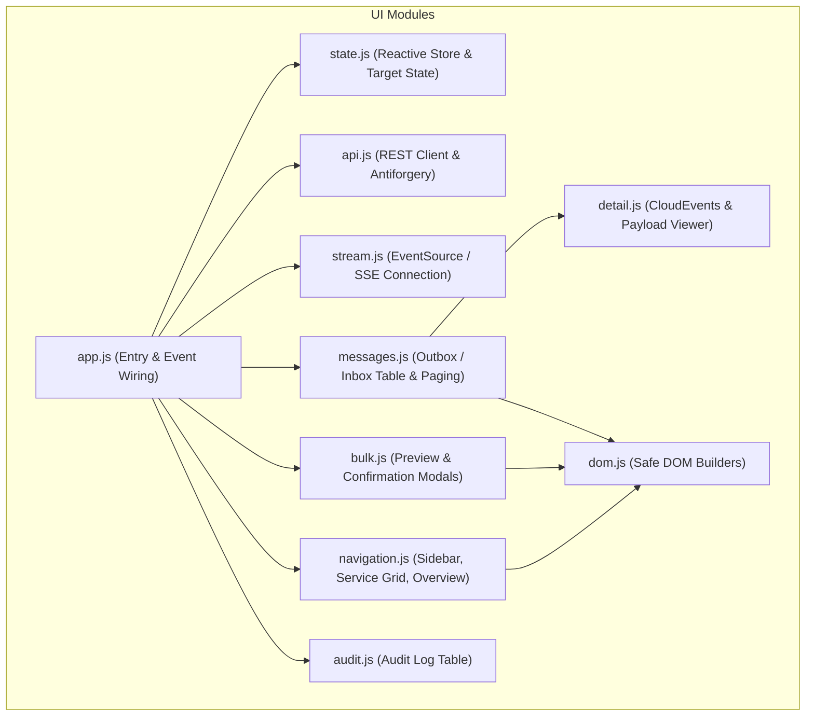

# Management & Control Plane Architecture

This document details the internal architecture, protocol, and design principles of Ratatoskr's **Management Control Plane** and embedded web dashboard.

The management subsystem provides a transport-neutral, fault-isolated mechanism to inspect running service replicas, monitor transactional Outbox and Inbox backlogs, triage and retry poisoned messages, manage broker channels and Dead Letter Queues (DLQs), and review historical mutation audit trails.

> [!TIP]
> For an overview of the global dual-plane system architecture, see the [Architecture Overview](architecture.md). For message publishing, transport, and consumption, see [Messaging Pipeline Architecture](messaging-architecture.md). For a setup and user guide, see [Management UI and Control Plane](management-ui.md).

---

## 1. Architectural Principles

The management architecture is governed by four design principles:

1. **Strict Plane Separation**: Management traffic runs on its own isolated transport connections. If application message queues become backlogged or stalled, management operations continue without delay.
2. **Transport Neutrality**: The control plane uses generic provider interfaces (`IManagementTransport`, `IManagementDiscoverySource`, `IManagementOperation`). The web dashboard does not reference RabbitMQ or application message transports; it can operate over local in-process memory channels, RabbitMQ AMQP, or future transport providers without code changes.
3. **At-Least-Once RPC with In-Database Idempotency**: Distributed control planes are subject to network partitions and dropped replies. All mutations accept an `OperationId` idempotency key, committing the mutation and an operational log record atomically in the application database to ensure safe retries.
4. **Defense in Depth**: Zero-eval, strict Content Security Policy (CSP), safe DOM generation (`textContent`), broker-validated user authentication (`user_id`), optional HMAC signatures, and granular ASP.NET Core authorization policies.

---

## 2. System Context & Component Topology



---

## 3. The 4-Tier Identity & Targeting Hierarchy

The control plane models resources across a four-tier identity hierarchy:

$$\text{Transport} \longrightarrow \text{Service} \longrightarrow \text{Instance} \longrightarrow \text{Context}$$



- **Transport**: The communication network (e.g. `"local"`, `"primary-broker"`, `"dr-broker"`). A dashboard can simultaneously monitor multiple transports, making multi-broker setups or live broker migrations visible in one place.
- **Service**: The logical application name (e.g. `"orders-service"`).
- **Instance**: A specific replica of the service (e.g. `"orders-pod-4a2f"`).
- **Context**: An EF Core `DbContext` registered in that service managing Outbox/Inbox tables.

### Targeting Modes
Requests encapsulate their destination in a `ManagementTarget(ServiceName, InstanceId, Resource)`:

1. **Logical Service Targeting** (`InstanceId = null`):
   Commands address the service as a whole. Routed to the shared durable service queue (`{prefix}.mgmt.cmd.{service}.q`). All live replicas compete as consumers on this queue, so exactly one replica handles the command.
2. **Instance Targeting** (`InstanceId = "orders-pod-4a2f"`):
   Commands route directly to that replica’s exclusive instance queue (`{prefix}.mgmt.cmd.{service}.{instance}.q`). When publishing, `mandatory = true` is set. If the replica is stopped or disconnected, the broker immediately returns `312 NO_ROUTE` (`OnReturnedAsync`), failing fast with `target_unreachable` instead of blocking until deadline expiration.

---

## 4. Service Discovery, Liveness & Persistent Hydration

Services actively announce themselves to the dashboard via periodic heartbeats.



### Reliability Mechanics

- **Strict Monotonic Timestamping**:
  `ServiceRegistry.Publish` verifies that `AnnouncedAt > existing.AnnouncedAt`. Delayed fanout deliveries or out-of-order heartbeats across network channels can never regress the in-memory state.
- **Crash-Resilient Startup (Zero Blank Dashboard)**:
  When a dashboard host restarts, `DashboardServiceStore` loads stored snapshots from `RatatoskrDashboardDbContext.ServiceSnapshots`. Replicas immediately render in the UI with their last known state marked `stale` by age, eliminating the blank dashboard window during incident restarts.
- **Liveness Transitions**:
  Replicas announce every `HeartbeatInterval` (default 15s). If an announcement is not received within `StaleAfter` (default 45s, 3 intervals), the replica status transitions to `Stale`. Stale replicas remain visible in the UI along with their last known backlog counts, ensuring operators are alerted to unreachable services rather than seeing them disappear.
- **SSE Frame Coalescing**:
  `DashboardEventStream` delivers updates to connected browsers using a `Channel.CreateBounded<byte>(1)` configured with `BoundedChannelFullMode.DropOldest`. If hundreds of replicas heartbeat simultaneously, updates collapse into a single redraw frame. A 15-second `:keep-alive\n\n` comment prevents reverse proxies (NGINX, Cloudflare, Traefik) from terminating idle streams.

---

## 5. RPC Protocol & Wire Execution Pipeline

Every management operation — whether coming from the direct per-service HTTP REST API or routed through the central dashboard — funnels through the exact same `IManagementDispatcher`.

```mermaid
flowchart TD
    Req[Incoming ManagementRequestEnvelope] --> ProtocolCheck{Protocol Compatible?}
    ProtocolCheck -- No --> RetProto[Return 400 UnsupportedProtocolVersion]
    ProtocolCheck -- Yes --> DeadlineCheck{Deadline Remaining > 0?}
    DeadlineCheck -- No --> RetDead[Return 504 DeadlineExceeded]
    DeadlineCheck -- Yes --> ResolveOp[Resolve IManagementOperation from DI Scope]
    ResolveOp --> Found{Found?}
    Found -- No --> RetUnsup[Return 400 UnsupportedOperation]
    Found -- Yes --> ParseBody[Deserialize Payload with ManagementJson]
    ParseBody --> Exec[ExecuteAsync with Linked TokenSource\n(Cancellation + Remaining Deadline)]
    Exec --> Success{Success?}
    Success -- Yes --> RetOk[Return ManagementResponseEnvelope.Ok]
    Success -- No / Catch --> RetFail[Return ManagementResponseEnvelope.Failed\n(Stable Error Code + Log details)]
```

### The Request Envelope Structure

`ManagementRequestEnvelope` carries the invocation context:
- `ProtocolVersion`: Wire protocol compatibility version (e.g. `1.0`).
- `RequestId`: Unique correlation ID for the attempt (propagated from HTTP `TraceIdentifier` or AMQP `CorrelationId`).
- `OperationId`: Stable GUID identifying the logical mutation across retries.
- `Deadline`: Absolute UTC cutoff. The dispatcher drops the work if the budget expired in queue before processing begins (`deadline_exceeded`).
- `Actor`: Authenticated caller identity (`Subject`, `DisplayName`, `AuthenticationType`, `CorrelationId`).
- `Payload`: `JsonElement` body avoiding double base64 encoding.
- `ReplyTo`: Formatted transport return address (`"{exchange}|{routingKey}"`).

### Error Mapping
Failures are captured in `ManagementResponseEnvelope.Failed` carrying stable error codes:

| Error Code | HTTP Status | Meaning | Retryable |
|---|---|---|---|
| `target_unreachable` | 404 | Target service or instance queue is not registered or not listening. | No |
| `unsupported_operation` | 400 | Operation is not supported by the target service. | No |
| `invalid_argument` | 400 | Missing mandatory parameters or invalid cursor. | No |
| `conflict` | 409 | Operation ID was already applied with different parameters. | No |
| `deadline_exceeded` | 504 | Target service did not answer before the deadline elapsed. | Yes |
| `transport_unavailable` | 503 | Underlying transport or broker connection dropped. | Yes |
| `internal_error` | 500 | Unhandled exception occurred during execution. | No |

---

## 6. EF Core Durability Operations & Idempotency Engine

Mutations (requeue, delete, bulk matching mutations) in distributed systems are vulnerable to duplicated executions when responses are dropped or timeouts occur. Ratatoskr solves this with an atomic, in-database idempotency engine.



### Single-Item Mutations
For single-transaction operations (`outbox.requeue`, `outbox.delete`, `inbox.requeue`, `inbox.delete`), `ManagementOperationLog.StageCompleted` stages a `ManagementOperationEntity` row in the same `DbContext`. The entity mutations and idempotency record commit in the exact same database transaction.

### Bounded Bulk Operations (`MatchingMutationOperation`)
Bulk operations (`outbox.requeueMatching`, `outbox.deleteMatching`, `inbox.requeueMatching`, `inbox.deleteMatching`) apply changes across thousands of rows safely:

1. **Mandatory Filters**: Unbounded requests are rejected with HTTP 400. At least one filter (`Status`, `From`, `To`, `Search`) is required.
2. **Two-Phase Confirmation**: The caller or UI queries the matching count via `*.count` and displays a preview before confirming execution.
3. **Resumable Batch Execution**:
   - Commits in batches (default 100) up to a hard ceiling (`MaxTotalOperations`, default 10,000).
   - Each batch saves entity changes and updates `ManagementOperationEntity.ProcessedCount`.
   - `BatchDeadlineMargin` (2s) ensures the batch loop terminates with enough time to write the final status and send the network reply before the RPC deadline expires.
   - If capped or timed out, returns `{ processed: 10000, remaining: 1420, capped: true }`. Calling again with the same `OperationId` resumes from the recorded count!
4. **Anti-Tampering Guard**:
   The serialized filter JSON is saved in `ManagementOperationEntity.FilterJson`. If a request reuses an `OperationId` with an altered filter, it is refused with `409 Conflict`.

---

## 7. Channel Topology & Dead Letter Queue (DLQ) Management

Ratatoskr exposes broker queue metrics and DLQ triage capabilities via `RabbitMqDlqOperations`:



- **Metrics**: Real-time message count in main queues and Dead Letter Queues across all registered channels.
- **Batch DLQ Requeueing**:
  - Pulls messages from the DLQ via `BasicGetAsync(autoAck: false)`.
  - Strips the AMQP `x-death` header to reset poison retry counters.
  - Injects `x-requeued-from-dlq-at` timestamp header for distributed tracing.
  - Publishes messages back to the channel exchange using the original routing key (`BasicProperties.Type`).
  - ACKs from DLQ only after confirmation.
- **DLQ Purging**: Clears abandoned poisoned messages via `QueuePurgeAsync` following operator confirmation.

---

## 8. Web Dashboard Frontend Architecture

The embedded web dashboard (`Ratatoskr.UI`) is served directly from embedded assembly resources:



### Key Frontend Capabilities
- **Zero NPM / Zero Build Tooling**: 100% vanilla ECMAScript modules served as embedded assembly resources.
- **Strict Content Security Policy (CSP)**:
  ```http
  Content-Security-Policy: default-src 'self'; base-uri 'none'; frame-ancestors 'none'; form-action 'self'; object-src 'none'; script-src 'self'; style-src 'self'; connect-src 'self'
  ```
  Dynamic rendering uses `document.createElement` and `textContent` in `dom.js` — immune to stored XSS from malicious message payloads.
- **Keyset (Cursor) Pagination**:
  Avoids expensive database `OFFSET` queries. The UI maintains a client-side cursor stack to navigate forward and backward smoothly.
- **Capability Gating**:
  The UI inspects capabilities advertised in the service announcement and disables unsupported action buttons before the operator clicks them.
- **Antiforgery Integration**:
  Cookie-authenticated browser sessions automatically fetch and submit CSRF tokens via `api.js`. External scripts using `Authorization: Bearer <token>` bypass antiforgery requirements.

---

## Related Topics

- [Architecture Overview](architecture.md) — High-level dual-plane system architecture and package overview
- [Messaging Pipeline Architecture](messaging-architecture.md) — Internals of the messaging, outbox, and inbox pipelines
- [Management UI and Control Plane](management-ui.md) — Setup and operations guide for the dashboard
- [Management HTTP API Reference](management-api.md) — Complete REST endpoint reference
