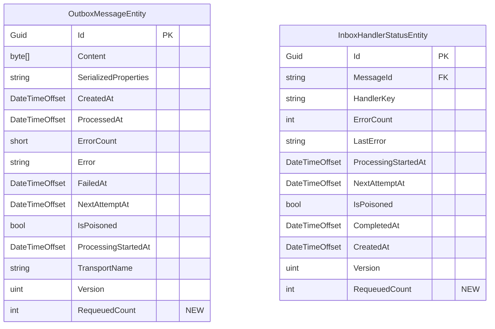

# feat: Ratatoskr Management UI — Multi-Service Dashboard

## Overview

Add a Management UI and API to the Ratatoskr ecosystem. Operators can view poisoned
Inbox/Outbox messages across all their microservices in a single Angular 21 dashboard and
requeue or delete them without writing code. The UI acts as a global aggregator—a single
`UseRatatoskrUi(options)` call in any service can proxy to N remote backends.

Primary deliverables:

1. `IRatatoskrEndpointConfigurator` extensibility interface in core.
2. EfCore management API endpoints (outbox + inbox CRUD, requeue, bulk, health).
3. RabbitMq health endpoint.
4. New NuGet package `Ratatoskr.UI` — SPA host + backend proxy.
5. Angular 21 frontend.
6. OrderService example proving multi-backend aggregation.
7. TUnit integration tests for all endpoints.

---

## Technical Approach

### Architecture

```
Angular SPA  ──► /ratatoskr/api/v1/backends/{name}/*  ──► Ratatoskr.UI proxy
                                                            │
                                  ┌─────────────────────────┤
                                  │                         │
                             LocalBackend              RemoteBackend
                          (in-process dispatch)      (HttpClient + auth)
                                  │                         │
                       IRatatoskrEndpointConfigurator   (same interface)
                       ├─ EfCoreEndpointConfigurator
                       └─ RabbitMqEndpointConfigurator
```

All endpoints versioned under `/ratatoskr/api/v1/`.  
Authorization is required for every endpoint — no anonymous mode.

---

## Phase 1 — Core: Extensibility Interface

### Files to create

**`src/Ratatoskr/Endpoints/IRatatoskrEndpointConfigurator.cs`**
```csharp
namespace Ratatoskr.Endpoints;

public interface IRatatoskrEndpointConfigurator
{
    void MapEndpoints(IEndpointRouteBuilder endpoints, string policyName);
}
```

**`src/Ratatoskr/Endpoints/ILocalRatatoskrRequestFeature.cs`**
```csharp
namespace Ratatoskr.Endpoints;

/// <summary>
/// Marker feature set only by in-process proxy dispatch. Cannot be spoofed via HTTP.
/// Authorization handlers check for this feature to bypass policy checks for local backends.
/// </summary>
public interface ILocalRatatoskrRequestFeature { }

internal sealed class LocalRatatoskrRequestFeature : ILocalRatatoskrRequestFeature { }
```

**`src/Ratatoskr/Endpoints/ManagementApiEndpointExtensions.cs`**
```csharp
namespace Ratatoskr.Endpoints;

public static class ManagementApiEndpointExtensions
{
    public static IEndpointRouteBuilder MapRatatoskrManagementApi(
        this IEndpointRouteBuilder endpoints,
        string policyName)
    {
        ArgumentException.ThrowIfNullOrWhiteSpace(policyName);

        // Validate the policy exists at startup rather than at first request.
        var authOptions = endpoints.ServiceProvider
            .GetRequiredService<IOptions<AuthorizationOptions>>().Value;
        if (authOptions.GetPolicy(policyName) is null)
            throw new InvalidOperationException(
                $"Authorization policy '{policyName}' is not registered. " +
                "Call services.AddAuthorization() and define the policy before calling MapRatatoskrManagementApi.");

        var configurators = endpoints.ServiceProvider
            .GetServices<IRatatoskrEndpointConfigurator>();

        foreach (var configurator in configurators)
            configurator.MapEndpoints(endpoints, policyName);

        return endpoints;
    }
}
```

**`src/Ratatoskr/Endpoints/LocalRatatoskrBypassAuthorizationHandler.cs`**
```csharp
namespace Ratatoskr.Endpoints;

/// <summary>
/// Succeeds any authorization requirement when the request was dispatched
/// in-process by the local backend proxy (ILocalRatatoskrRequestFeature present).
/// Registered as singleton during AddRatatoskr().
/// </summary>
internal sealed class LocalRatatoskrBypassAuthorizationHandler
    : IAuthorizationHandler
{
    public Task HandleAsync(AuthorizationHandlerContext context)
    {
        var httpContext = context.Resource as HttpContext
            ?? (context.Resource as DefaultHttpContext);

        if (httpContext?.Features.Get<ILocalRatatoskrRequestFeature>() is not null)
            foreach (var req in context.PendingRequirements.ToList())
                context.Succeed(req);

        return Task.CompletedTask;
    }
}
```

### Files to modify

**`src/Ratatoskr/ServiceCollectionExtensions.cs`** — add inside `AddRatatoskr`:
```csharp
services.AddSingleton<IAuthorizationHandler, LocalRatatoskrBypassAuthorizationHandler>();
```

---

## Phase 2 — EfCore: Entity & Model Changes

### Files to modify

**`src/Ratatoskr.EfCore/Ratatoskr.EfCore.csproj`** — add inside `<ItemGroup>`:
```xml
<FrameworkReference Include="Microsoft.AspNetCore.App" />
```

**`src/Ratatoskr.EfCore/Internal/OutboxMessageEntity.cs`** — add property:
```csharp
public int RequeuedCount { get; set; }
```

**`src/Ratatoskr.EfCore/Internal/InboxHandlerStatusEntity.cs`** — add property:
```csharp
public int RequeuedCount { get; set; }
```

**`src/Ratatoskr.EfCore/Internal/RatatoskrEntityModelConfiguration.cs`**

In `ConfigureOutboxEntities`:
```csharp
builder.Property(x => x.RequeuedCount).HasDefaultValue(0);
```

In `ConfigureInboxEntities` (for `InboxHandlerStatusEntity`):
```csharp
builder.Property(x => x.RequeuedCount).HasDefaultValue(0);
```

> **Migration note (no auto-migration):** Users applying manual migrations should run:
> ```sql
> ALTER TABLE "OutboxMessages"    ADD COLUMN "RequeuedCount" integer NOT NULL DEFAULT 0;
> ALTER TABLE "InboxHandlerStatuses" ADD COLUMN "RequeuedCount" integer NOT NULL DEFAULT 0;
> ```

### Schema ERD (delta)



---

## Phase 3 — EfCore: Management API Endpoints

All DTOs and the configurator live in `src/Ratatoskr.EfCore/Management/`.

### Response DTOs

**`src/Ratatoskr.EfCore/Management/Dto/OutboxDtos.cs`**
```csharp
internal record OutboxPoisonedListItemDto(
    Guid Id,
    string MessageType,
    DateTimeOffset CreatedAt,
    int ErrorCount,
    int RequeuedCount,
    string? LastError,
    string DbContext);

internal record OutboxPoisonedDetailDto(
    Guid Id,
    string MessageType,
    DateTimeOffset CreatedAt,
    int ErrorCount,
    int RequeuedCount,
    string? LastError,
    DateTimeOffset? FailedAt,
    JsonElement Properties,
    string? JsonPayload,
    string PayloadBase64,
    string DbContext);

internal record PaginatedResponse<T>(
    List<T> Items,
    long TotalCount,
    string? NextCursor);
```

**`src/Ratatoskr.EfCore/Management/Dto/InboxDtos.cs`**
```csharp
internal record InboxPoisonedListItemDto(
    Guid HandlerStatusId,
    string MessageId,
    string MessageType,
    string HandlerKey,
    DateTimeOffset ReceivedAt,
    int ErrorCount,
    int RequeuedCount,
    string? LastError,
    string DbContext);

internal record InboxPoisonedDetailDto(
    Guid HandlerStatusId,
    string MessageId,
    string MessageType,
    string HandlerKey,
    DateTimeOffset ReceivedAt,
    int ErrorCount,
    int RequeuedCount,
    string? LastError,
    JsonElement Properties,
    string? JsonPayload,
    string PayloadBase64,
    string DbContext);

internal record InboxMessageHandlersDto(
    string MessageId,
    string MessageType,
    DateTimeOffset ReceivedAt,
    List<InboxPoisonedListItemDto> Handlers);
```

**`src/Ratatoskr.EfCore/Management/Dto/HealthDtos.cs`**
```csharp
internal record HealthOverviewDto(List<DbContextHealthDto> DbContexts);

internal record DbContextHealthDto(
    string DbContextName,
    long PoisonedOutboxCount,
    long PoisonedInboxCount,
    long PendingOutboxCount,
    long PendingInboxCount,
    DateTimeOffset? LastOutboxProcessedAt,
    DateTimeOffset? LastInboxProcessedAt);
```

**`src/Ratatoskr.EfCore/Management/Dto/BulkActionRequest.cs`**
```csharp
// body: { "ids": ["..."] }  OR  { "all": true }
internal record BulkActionRequest(List<Guid>? Ids, bool? All);

internal record BulkActionResult(List<Guid> Succeeded, List<BulkFailure> Failed);
internal record BulkFailure(Guid Id, string Reason);
```

### Requeue helper (shared logic)

**`src/Ratatoskr.EfCore/Management/RequeueHelper.cs`**
```csharp
internal static class RequeueHelper
{
    // Returns IResult: 200 OK | 404 Not Found | 400 Bad Request | 409 Conflict
    internal static async Task<IResult> RequeueOutboxAsync(
        DbContext dbContext,
        Guid id,
        TimeProvider timeProvider,
        CancellationToken ct)
    {
        // Cast to the internal set via the IOutboxDbContext interface
        var entity = await dbContext.Set<OutboxMessageEntity>()
            .SingleOrDefaultAsync(x => x.Id == id, ct);

        if (entity is null) return Results.NotFound();
        if (!entity.IsPoisoned) return Results.BadRequest("Message is not poisoned.");

        entity.IsPoisoned = false;
        entity.ErrorCount = 0;
        entity.Error = null;
        entity.NextAttemptAt = null;
        entity.ProcessingStartedAt = null;  // CRITICAL: clear stuck-detection timestamp
        entity.RequeuedCount++;

        try
        {
            await dbContext.SaveChangesAsync(ct);
            return Results.Ok();
        }
        catch (DbUpdateConcurrencyException)
        {
            return Results.Conflict("Message was modified concurrently. Refresh and retry.");
        }
    }

    internal static async Task<IResult> RequeueInboxHandlerAsync(
        DbContext dbContext,
        Guid handlerStatusId,
        TimeProvider timeProvider,
        CancellationToken ct)
    {
        var entity = await dbContext.Set<InboxHandlerStatusEntity>()
            .SingleOrDefaultAsync(x => x.Id == handlerStatusId, ct);

        if (entity is null) return Results.NotFound();
        if (!entity.IsPoisoned) return Results.BadRequest("Handler status is not poisoned.");

        entity.IsPoisoned = false;
        entity.ErrorCount = 0;
        entity.LastError = null;
        entity.NextAttemptAt = null;
        entity.ProcessingStartedAt = null;
        entity.RequeuedCount++;

        try
        {
            await dbContext.SaveChangesAsync(ct);
            return Results.Ok();
        }
        catch (DbUpdateConcurrencyException)
        {
            return Results.Conflict("Handler status was modified concurrently. Refresh and retry.");
        }
    }
}
```

### Main configurator

**`src/Ratatoskr.EfCore/Management/EfCoreEndpointConfigurator.cs`**

Implements `IRatatoskrEndpointConfigurator`. The class is generic on `TDbContext` and registered once per DbContext.

```csharp
internal sealed class EfCoreEndpointConfigurator<TDbContext> : IRatatoskrEndpointConfigurator
    where TDbContext : DbContext
{
    private readonly string _dbContextName = typeof(TDbContext).Name;

    public void MapEndpoints(IEndpointRouteBuilder endpoints, string policyName)
    {
        var group = endpoints
            .MapGroup("/ratatoskr/api/v1")
            .RequireAuthorization(policyName);

        MapOutboxEndpoints(group);
        MapInboxEndpoints(group);
        MapHealthEndpoint(group);
    }
    // ... (see endpoint details below)
}
```

#### Outbox endpoints implementation notes

`GET /ratatoskr/api/v1/outbox/poisoned`
- Query: `WHERE IsPoisoned = true`
- Cursor: URL-safe base64 of last seen `Id` (UUIDv7, monotonic)
- Filtering: `type` query param applied in-memory after projection (poisoned sets are small)
- Date range: `from`/`to` on `CreatedAt`, applied as EF WHERE clauses
- Include `TotalCount` from `COUNT(*)` (separate query, no tracking)
- Deserialize `SerializedProperties` → extract message type

`POST /ratatoskr/api/v1/outbox/poisoned/{id}/requeue`
- Delegates to `RequeueHelper.RequeueOutboxAsync`
- Returns 200/400/404/409

`DELETE /ratatoskr/api/v1/outbox/poisoned/{id}`
- Load entity, verify `IsPoisoned = true`, delete
- Returns 200/404
- If processor concurrently deletes → `DbUpdateConcurrencyException` → 409

`POST /ratatoskr/api/v1/outbox/poisoned/requeue` (bulk)
- Body: `BulkActionRequest`
- If `All = true`: `UPDATE ... SET IsPoisoned=false, ErrorCount=0, ... WHERE IsPoisoned=true`
  (executed as a single `ExecuteUpdateAsync` for efficiency)
- If `Ids` list: loop + `RequeueHelper.RequeueOutboxAsync` per ID, collect successes/failures
- Returns `BulkActionResult`

`DELETE /ratatoskr/api/v1/outbox/poisoned` (bulk)
- Body: `BulkActionRequest`
- If `All = true`: `ExecuteDeleteAsync` WHERE IsPoisoned=true
- If `Ids` list: `ExecuteDeleteAsync` WHERE Id IN (ids) AND IsPoisoned=true

#### Inbox endpoints implementation notes

`GET /ratatoskr/api/v1/inbox/poisoned`
- Join `InboxHandlerStatusEntity` ← `InboxMessageEntity` for `ReceivedAt` + `SerializedProperties`
- Same cursor/filter/count pattern as outbox

`GET /ratatoskr/api/v1/inbox/messages/{messageId}/handlers`
- Returns ALL handler statuses for the message (not only poisoned)
- Used by the Angular expandable row to show sibling handlers

`POST /ratatoskr/api/v1/inbox/messages/{messageId}/requeue`
- Requeues all POISONED handler statuses for the message (skips completed/pending)
- Returns list of requeued handler IDs

`DELETE /ratatoskr/api/v1/inbox/poisoned/{handlerStatusId}`
- Delete the `InboxHandlerStatusEntity`
- **Cascade orphan cleanup**: if no remaining `InboxHandlerStatusEntity` rows for the
  parent `InboxMessageEntity`, delete the parent too to avoid accumulating orphans.

#### Health endpoint

`GET /ratatoskr/api/v1/health`
- Reads `EfCoreMetricsState` singleton for cached counts (PoisonedOutboxCount,
  PoisonedInboxCount, PendingOutboxCount, PendingInboxCount)
- Resolves `OutboxProcessor<TDbContext>` and `InboxProcessor<TDbContext>` from DI to
  get `LastSuccessfulProcessingAt` (returns null if processor not registered)
- Returns `DbContextHealthDto`

> Note: cached counts have a staleness window equal to `EfCoreMetricsBackgroundService`
> polling interval. The response includes a `CachedAt` timestamp from `EfCoreMetricsState`.

### DI registration

**`src/Ratatoskr.EfCore/PublicApiExtensions.cs`** — inside `AddEfCoreDurability<TDbContext>`:
```csharp
services.AddSingleton<IRatatoskrEndpointConfigurator,
    EfCoreEndpointConfigurator<TDbContext>>();
```

---

## Phase 4 — RabbitMq: Health Endpoint

### Files to modify

**`src/Ratatoskr.RabbitMq/Ratatoskr.RabbitMq.csproj`**:
```xml
<FrameworkReference Include="Microsoft.AspNetCore.App" />
```
Replace the existing `Microsoft.Extensions.Diagnostics.HealthChecks` NuGet reference
(the FrameworkReference provides it transitively).

### Files to create

**`src/Ratatoskr.RabbitMq/Management/RabbitMqHealthDto.cs`**
```csharp
internal record RabbitMqHealthDto(
    bool IsConnected,
    bool IsHealthy,
    string? ConnectionError);
```

**`src/Ratatoskr.RabbitMq/Management/RabbitMqEndpointConfigurator.cs`**
```csharp
internal sealed class RabbitMqEndpointConfigurator : IRatatoskrEndpointConfigurator
{
    public void MapEndpoints(IEndpointRouteBuilder endpoints, string policyName)
    {
        endpoints.MapGet(
            "/ratatoskr/api/v1/rabbitmq/health",
            (RabbitMqConnectionManager conn, RabbitMqConsumer consumer) =>
            {
                var connected = conn.IsConnected;   // add IsConnected property
                var healthy = consumer.IsHealthy;
                return Results.Ok(new RabbitMqHealthDto(connected, healthy, null));
            })
            .RequireAuthorization(policyName);
    }
}
```

**`src/Ratatoskr.RabbitMq/Extensions/RabbitMqRatatoskrBuilderExtensions.cs`** — add inside `UseRabbitMq`:
```csharp
builder.Services.AddSingleton<IRatatoskrEndpointConfigurator,
    RabbitMqEndpointConfigurator>();
```

> `RabbitMqConnectionManager` needs a public `bool IsConnected` property added,
> based on whether the internal `IConnection` is non-null and open.

---

## Phase 5 — Ratatoskr.UI: Proxy Package

New NuGet package. Uses Razor Class Library SDK to distribute Angular build output as static web assets.

### `src/Ratatoskr.UI/Ratatoskr.UI.csproj`
```xml
<Project Sdk="Microsoft.NET.Sdk.Razor">
  <PropertyGroup>
    <TargetFramework>net10.0</TargetFramework>
    <Nullable>enable</Nullable>
    <ImplicitUsings>enable</ImplicitUsings>
    <AddRazorSupportForMvc>false</AddRazorSupportForMvc>
    <StaticWebAssetBasePath>ratatoskr-ui</StaticWebAssetBasePath>
    <IsPackable>true</IsPackable>
    <PackageId>Ratatoskr.UI</PackageId>
  </PropertyGroup>

  <ItemGroup>
    <FrameworkReference Include="Microsoft.AspNetCore.App" />
    <ProjectReference Include="..\Ratatoskr\Ratatoskr.csproj" />
  </ItemGroup>

  <!-- Build Angular before .NET build (release or explicit opt-in) -->
  <Target Name="BuildAngularApp"
          BeforeTargets="Build"
          Condition="'$(Configuration)' == 'Release' Or '$(BuildAngular)' == 'true'">
    <Message Text="Building Angular app..." Importance="high" />
    <Exec Command="npm ci"
          WorkingDirectory="$(MSBuildThisFileDirectory)ClientApp"
          Condition="!Exists('$(MSBuildThisFileDirectory)ClientApp\node_modules')" />
    <Exec Command="npx ng build --configuration production --output-path=../wwwroot"
          WorkingDirectory="$(MSBuildThisFileDirectory)ClientApp" />
  </Target>

  <ItemGroup>
    <Content Include="wwwroot\**" CopyToOutputDirectory="PreserveNewest" />
  </ItemGroup>
</Project>
```

### Backend configuration model

**`src/Ratatoskr.UI/RatatoskrUiOptions.cs`**
```csharp
public sealed class RatatoskrUiOptions
{
    public string BasePath { get; set; } = "/ratatoskr";
    internal List<BackendRegistration> Backends { get; } = [];

    public void AddLocalBackend(string name)
        => Backends.Add(new BackendRegistration(name, null, null, IsLocal: true));

    public void AddBackend(string name, string baseUrl,
        Action<AuthDelegateBuilder>? configureAuth = null)
    {
        var builder = new AuthDelegateBuilder();
        configureAuth?.Invoke(builder);
        Backends.Add(new BackendRegistration(name, baseUrl, builder.Build(), IsLocal: false));
    }
}

internal sealed record BackendRegistration(
    string Name,
    string? BaseUrl,
    Func<HttpRequestMessage, Task>? AuthDelegate,
    bool IsLocal);
```

**`src/Ratatoskr.UI/AuthDelegateBuilder.cs`**
```csharp
public sealed class AuthDelegateBuilder
{
    private Func<HttpRequestMessage, Task>? _delegate;

    /// <summary>
    /// Provide a custom delegate to mutate the outgoing request (add headers, tokens, etc.).
    /// Built-in helpers (ForwardCookies, UseApiKey) are reserved for future versions.
    /// </summary>
    public void UseDelegate(Func<HttpRequestMessage, Task> handler) =>
        _delegate = handler;

    internal Func<HttpRequestMessage, Task>? Build() => _delegate;
}
```

### Local backend dispatcher

**`src/Ratatoskr.UI/Proxy/LocalBackendDispatcher.cs`**
```csharp
/// <summary>
/// Dispatches requests in-process, bypassing HTTP round-trip.
/// Sets ILocalRatatoskrRequestFeature on the synthetic context so the
/// authorization bypass handler grants unconditional access.
/// </summary>
internal sealed class LocalBackendDispatcher(
    RequestDelegate appDelegate,
    IHttpContextFactory contextFactory)
{
    public async Task<HttpResponseMessage> DispatchAsync(
        HttpContext incomingContext,
        string targetPath,
        CancellationToken ct)
    {
        var features = new FeatureCollection(incomingContext.Features);
        features.Set<ILocalRatatoskrRequestFeature>(new LocalRatatoskrRequestFeature());

        var syntheticContext = contextFactory.Create(features);
        syntheticContext.Request.Method = incomingContext.Request.Method;
        syntheticContext.Request.Path = targetPath;
        syntheticContext.Request.QueryString = incomingContext.Request.QueryString;
        syntheticContext.Request.ContentType = incomingContext.Request.ContentType;
        syntheticContext.Request.Body = incomingContext.Request.Body;

        // Capture response body
        var responseBuffer = new MemoryStream();
        syntheticContext.Response.Body = responseBuffer;

        await appDelegate(syntheticContext);

        responseBuffer.Seek(0, SeekOrigin.Begin);
        var response = new HttpResponseMessage((HttpStatusCode)syntheticContext.Response.StatusCode)
        {
            Content = new StreamContent(responseBuffer)
        };
        foreach (var header in syntheticContext.Response.Headers)
            response.Headers.TryAddWithoutValidation(header.Key, (IEnumerable<string?>)header.Value);
        return response;
    }
}
```

### Proxy middleware + routes

**`src/Ratatoskr.UI/ApplicationBuilderExtensions.cs`**
```csharp
public static class ApplicationBuilderExtensions
{
    public static IApplicationBuilder UseRatatoskrUi(
        this IApplicationBuilder app,
        Action<RatatoskrUiOptions> configure)
    {
        var options = new RatatoskrUiOptions();
        configure(options);

        var basePath = options.BasePath.TrimEnd('/');

        // Serve Angular SPA static assets
        app.UseStaticFiles(new StaticFileOptions
        {
            RequestPath = basePath
        });

        return app;
    }

    public static IEndpointRouteBuilder MapRatatoskrUiRoutes(
        this IEndpointRouteBuilder endpoints,
        RatatoskrUiOptions options)
    {
        var basePath = options.BasePath.TrimEnd('/');

        // GET /ratatoskr/api/v1/backends — list backends with status
        endpoints.MapGet($"{basePath}/api/v1/backends", (IHttpClientFactory _) =>
            Results.Ok(options.Backends.Select(b => new { b.Name, b.IsLocal })));

        // GET /ratatoskr/api/v1/dashboard — parallel health fan-out
        endpoints.MapGet($"{basePath}/api/v1/dashboard",
            async (IHttpClientFactory http, LocalBackendDispatcher local,
                   IHttpContextAccessor accessor, CancellationToken ct) =>
            {
                var tasks = options.Backends.Select(b =>
                    FetchBackendHealthAsync(b, http, local, accessor.HttpContext!, ct));

                var results = await Task.WhenAll(tasks);
                var errors = results.Where(r => r.Error is not null).ToList();
                return Results.Ok(new { Backends = results, Errors = errors });
            });

        // ANY /ratatoskr/api/v1/backends/{name}/{**rest} — transparent passthrough
        endpoints.Map($"{basePath}/api/v1/backends/{{name}}/{{**rest}}",
            async (string name, string? rest, HttpContext ctx,
                   IHttpClientFactory http, LocalBackendDispatcher local,
                   CancellationToken ct) =>
            {
                var backend = options.Backends
                    .FirstOrDefault(b => b.Name.Equals(name, StringComparison.OrdinalIgnoreCase));
                if (backend is null) return Results.NotFound($"Backend '{name}' not found.");

                var targetPath = $"/ratatoskr/api/v1/{rest}";
                HttpResponseMessage response;

                if (backend.IsLocal)
                {
                    response = await local.DispatchAsync(ctx, targetPath, ct);
                }
                else
                {
                    var client = http.CreateClient(name);
                    var request = new HttpRequestMessage(
                        new HttpMethod(ctx.Request.Method), targetPath);
                    if (backend.AuthDelegate is not null)
                        await backend.AuthDelegate(request);
                    response = await client.SendAsync(request, ct);
                }

                ctx.Response.StatusCode = (int)response.StatusCode;
                await response.Content.CopyToAsync(ctx.Response.Body, ct);
                return Results.Empty;
            });

        // SPA fallback: serve index.html for all non-API routes under basePath
        endpoints.MapFallback($"{basePath}/{{**path}}", async (HttpContext ctx) =>
        {
            ctx.Response.ContentType = "text/html";
            // Serve embedded index.html
            var assembly = typeof(ApplicationBuilderExtensions).Assembly;
            await using var stream = assembly.GetManifestResourceStream(
                "Ratatoskr.UI.wwwroot.index.html")!;
            await stream.CopyToAsync(ctx.Response.Body);
        });

        return endpoints;
    }
}
```

> **Auth delegate note:** v1 ships `UseDelegate` only. Callers inject whatever they need
> (Bearer tokens, API keys, etc.) via the delegate. Built-in helpers (`ForwardCookies`,
> `UseApiKey`) are reserved for a future release.

---

## Phase 6 — Angular 21 Frontend

Location: `src/Ratatoskr.UI/ClientApp/`

### Bootstrap

```
ClientApp/
├── angular.json
├── package.json           # Angular 21, @angular/material 21
├── tsconfig.json
├── proxy.conf.json        # /ratatoskr/api/* → http://localhost:5000
└── src/
    ├── main.ts
    ├── styles.scss        # CSS custom properties for theme
    ├── app/
    │   ├── app.config.ts  # provideRouter, provideHttpClient, provideAnimations
    │   ├── app.routes.ts  # routes: '' → dashboard, 'service/:name' → detail
    │   ├── app.component.ts           # shell with header
    │   │
    │   ├── core/
    │   │   ├── api.service.ts         # HttpClient wrapper; all API calls
    │   │   ├── theme.service.ts       # light/dark toggle, localStorage
    │   │   └── polling.service.ts     # configurable interval + countdown signal
    │   │
    │   ├── dashboard/
    │   │   ├── dashboard.component.ts # grid of service-card; uses polling.service
    │   │   └── service-card.component.ts
    │   │
    │   ├── service-detail/
    │   │   ├── service-detail.component.ts  # tabs: overview, outbox, inbox
    │   │   ├── overview-tab.component.ts
    │   │   ├── outbox-tab.component.ts      # paginated list + bulk actions
    │   │   ├── inbox-tab.component.ts       # paginated list + expandable rows
    │   │   └── message-drawer.component.ts  # properties + JSON viewer
    │   │
    │   └── models/
    │       └── api.types.ts           # TypeScript interfaces matching server DTOs
```

### Key implementation choices

- **Routing**: `HashLocationStrategy` (`useHash: true` in `provideRouter()`) — avoids base-href
  configuration complexity. Routes: `/#/`, `/#/service/Orders`.
- **State management**: Angular Signals only — no NgRx/RxJS observables.
- **Component library**: Angular Material 21 for table, tabs, drawer, chips.
- **Bulk selection**: page-scoped only. "Select all" calls the `{ all: true }` bulk endpoint.
- **Expandable inbox rows**: clicking "expand" triggers `GET /messages/{id}/handlers` fresh fetch.
- **Auto-refresh**: countdown signal decrements every second; on zero, refetch dashboard data and reset counter. User-configured interval stored in `localStorage` (default 30s).
- **Empty state**: each table shows a centered "No poisoned messages" illustration when list is empty.
- **Partial bulk failure**: if `BulkActionResult.failed` is non-empty, show an inline warning list inside the tab (no toasts; consistent with no-badge decision).

### `proxy.conf.json`
```json
{
  "/ratatoskr/api/*": {
    "target": "http://localhost:5000",
    "secure": false,
    "logLevel": "info"
  }
}
```

### `angular.json` serve config
```json
"serve": {
  "options": {
    "proxyConfig": "proxy.conf.json"
  }
}
```

---

## Phase 7 — OrderService Example

Adds a second service to `examples/AppHost` to prove multi-backend aggregation.

### Files to create

**`examples/OrderService/OrderService.csproj`** — `Microsoft.NET.Sdk.Web`, `net10.0`

**`examples/OrderService/Program.cs`** — Minimal API with:
- `AddRatatoskr(b => b.AddEfCoreDurability<OrdersDbContext>(...).UseInbox().UseOutbox())`
- `UseRabbitMq(...)` pointing to the shared Aspire RabbitMq resource
- `app.MapRatatoskrManagementApi("RatatoskrAdmin")`
- References shared Postgres on `ordersdb` database

**`examples/OrderService/Data/OrdersDbContext.cs`** — `DbContext` implementing `IInboxDbContext, IOutboxDbContext`

**`examples/OrderService/Messages/OrderCreatedEvent.cs`** — a sample event with handler

### Files to modify

**`examples/AppHost/Program.cs`** — add `OrderService`:
```csharp
var ordersDb = postgres.AddDatabase("ordersdb");
var orderService = builder.AddProject<Projects.OrderService>("order-service")
    .WithReference(ordersDb)
    .WithReference(rabbitMq);
```

**`examples/PlaygroundApi/Program.cs`** — add `UseRatatoskrUi` with both backends:
```csharp
app.UseRatatoskrUi(options =>
{
    options.AddLocalBackend("Playground");
    options.AddBackend("Orders", "http://order-service");
});
```

---

## Phase 8 — Tests

All test classes extend `RatatoskrIntegrationTest`. Use `AwesomeAssertions` for assertions.
TUnit runner: `dotnet run --project tests/Ratatoskr.Tests -- --maximum-parallel-tests 10`

### Files to create

**`tests/Ratatoskr.Tests/Integration/Management/OutboxManagementTests.cs`**
- `OutboxManagement_PoisonedList_ReturnsPaginatedResults`
- `OutboxManagement_PoisonedList_FilterByDateRange`
- `OutboxManagement_PoisonedList_OnlyReturnsPoisonedMessages`
- `OutboxManagement_Detail_IncludesJsonPayloadAndProperties`
- `OutboxManagement_Requeue_ClearsIsPoisonedAndResetsCounters`
- `OutboxManagement_Requeue_IncrementsRequeuedCount`
- `OutboxManagement_Requeue_ClearsProcessingStartedAt`  ← SpecFlow gap
- `OutboxManagement_Requeue_Returns400ForNonPoisonedMessage`  ← SpecFlow gap
- `OutboxManagement_Delete_RemovesMessage`
- `OutboxManagement_BulkRequeue_RequeuesAllSpecifiedIds`
- `OutboxManagement_BulkRequeue_All_RequeuesAllPoisoned`
- `OutboxManagement_BulkDelete_DeletesAllSpecifiedIds`

**`tests/Ratatoskr.Tests/Integration/Management/InboxManagementTests.cs`**
- `InboxManagement_PoisonedList_ReturnsPaginatedResults`
- `InboxManagement_RequeueHandler_ClearsIsPoisonedAndResetsCounters`
- `InboxManagement_RequeueAllHandlersForMessage_RequeuesOnlyPoisoned`
- `InboxManagement_GetHandlersForMessage_ReturnsAllStatuses`
- `InboxManagement_DeleteHandlerStatus_DeletesOrphanedParentMessage`  ← SpecFlow gap

**`tests/Ratatoskr.Tests/Integration/Management/HealthEndpointTests.cs`**
- `Health_ReturnsCachedCounts`
- `Health_LastProcessedAt_ReflectsProcessorState`

**`tests/Ratatoskr.Tests/Integration/Management/ManagementAuthorizationTests.cs`**
- `ManagementApi_UnauthenticatedRequest_Returns401`
- `ManagementApi_LocalBackend_BypassesAuthorization`
- `MapRatatoskrManagementApi_UnknownPolicy_ThrowsAtStartup`  ← SpecFlow gap

**`tests/Ratatoskr.Tests/Integration/Management/RequeuedCountTests.cs`**
- `RequeuedCount_IncrementsOnEachRequeue`
- `RequeuedCount_ErrorCountResetsOnRequeue`
- `CleanupService_SkipsPoisonedMessages` (regression)

---

## System-Wide Impact

### Interaction Graph
`POST /outbox/poisoned/{id}/requeue` →
  `EfCore SaveChangesAsync` →
    OutboxMessageEntity.IsPoisoned=false →
      `OutboxProcessor` next poll picks up row →
        `IMessageSender.SendAsync` →
          RabbitMq/EfCoreTransport publish

### State Lifecycle Risks

| Risk | Mitigation |
|------|-----------|
| Concurrent requeue + processor write | `DbUpdateConcurrencyException` → 409 Conflict returned to caller |
| Delete while processor holds entity | Processor gets concurrency exception; already-handled in processor loop |
| Stale `EfCoreMetricsState` after requeue | Document staleness window; no cache invalidation in v1 |
| Orphaned `InboxMessageEntity` after handler delete | Explicit cascade cleanup in delete handler |
| `ProcessingStartedAt` left set after requeue | Explicitly cleared in `RequeueHelper` |

### API Surface Parity
The `IRatatoskrEndpointConfigurator` interface ensures any future transport (e.g.,
`Ratatoskr.AzureServiceBus`) can contribute endpoints without modifying core.

### Integration Test Scenarios
1. Requeue → assert message re-processed → assert `RequeuedCount=1, ErrorCount=0`
2. Delete last handler status → assert parent `InboxMessageEntity` is deleted
3. Bulk requeue with `{ all: true }` → assert all poisoned messages cleared
4. Unauthorized request → assert 401
5. `MapRatatoskrManagementApi` with unknown policy → assert `InvalidOperationException` at startup

---

## Acceptance Criteria

### Functional

- [x] `IRatatoskrEndpointConfigurator` resolves all registered implementations via DI
- [x] All outbox management endpoints work: list, detail, requeue, delete, bulk
- [x] All inbox management endpoints work: list, detail, requeue (single + all), delete, bulk
- [x] Requeue: clears `IsPoisoned`, `ErrorCount`, `Error`, `NextAttemptAt`,
      `ProcessingStartedAt`; increments `RequeuedCount`
- [x] Delete last inbox handler status also deletes orphaned parent message
- [x] `{ all: true }` bulk operations scope to all poisoned (no implicit filter)
- [x] Health endpoint returns correct counts from cache + `LastSuccessfulProcessingAt` from processor
- [x] RabbitMq health endpoint returns connection/channel status
- [ ] `UseRatatoskrUi` proxy routes all API calls to correct backend *(Phase 5 — deferred)*
- [ ] Local backend dispatches in-process with auth bypass *(Phase 5 — deferred)*
- [ ] Remote backend calls apply the configured auth delegate *(Phase 5 — deferred)*
- [ ] Dashboard fan-out returns partial results on backend failure *(Phase 5 — deferred)*
- [ ] Angular dashboard shows service cards with colored indicators *(Phase 6 — deferred)*
- [ ] Service detail tabs (Overview, Outbox, Inbox) are functional *(Phase 6 — deferred)*
- [ ] Light/dark theme persists in `localStorage` *(Phase 6 — deferred)*
- [ ] Angular dev proxy routes API calls correctly during `aspire run` *(Phase 6 — deferred)*

### Non-Functional

- [x] `MapRatatoskrManagementApi` throws at startup if policy name not registered
- [x] All endpoints require the configured authorization policy
- [x] No anonymous / unauthenticated access to any management endpoint
- [x] `ILocalRatatoskrRequestFeature` is only settable by in-process code (no HTTP header mapping)
- [x] `RequeuedCount` column added via EF model config only — no auto-migration

### Quality Gates

- [x] TUnit integration tests pass for all endpoint behaviors listed in Phase 8
- [x] `RequeuedCount` increment and `ErrorCount` reset verified by tests
- [x] Cleanup service regression test: poisoned messages are never auto-deleted
- [ ] MSBuild successfully compiles Angular in CI (`Configuration=Release`) *(Phase 6 — deferred)*
- [ ] `aspire run` starts both PlaygroundApi + OrderService; dashboard shows both *(Phase 7 — deferred)*
- [x] All assertions use AwesomeAssertions
- [x] All DateTime/DateTimeOffset creation uses `TimeProvider`

---

## Resolved SpecFlow Gaps

| Gap | Resolution |
|-----|-----------|
| `ProcessingStartedAt` not in requeue reset | **MUST** clear it; explicit in `RequeueHelper` |
| Requeue of non-poisoned message | Return 400 Bad Request |
| Concurrent requeue conflict | Return 409 Conflict |
| Orphaned `InboxMessageEntity` after handler delete | Delete parent if no remaining handlers |
| `{ all: true }` scope | Global (all poisoned), no filter forwarding in v1 |
| Total count for pagination | Include `TotalCount` in every list response (separate COUNT query) |
| Multi-DbContext health shape | Array of `DbContextHealthDto` (one per registered TDbContext) |
| Bulk partial failure response | `BulkActionResult { Succeeded, Failed }` in 200 response |
| CSRF for state-mutating endpoints | Minimal API endpoints: add `.DisableAntiforgery()`. v1 uses token-based auth via `UseDelegate`; no cookie forwarding. |
| Policy name startup validation | `MapRatatoskrManagementApi` validates policy exists; throws `InvalidOperationException` |

---

## Open Questions (decide before implementation)

1. **Bulk select cross-page**: v1 spec is page-scoped + `{ all: true }`. Confirm this is acceptable.
2. **Processing rate metric**: Not yet in `EfCoreMetricsState`. Add a rolling-window counter
   (`ProcessedLastMinuteCount`) to `DbContextMetrics`, or omit from v1 health response?
3. **Angular component library**: Angular Material 21 assumed. Confirm or specify alternative.

---

## Sources & References

### Internal References

- Entity models: `src/Ratatoskr.EfCore/Internal/OutboxMessageEntity.cs`,
  `InboxHandlerStatusEntity.cs`, `InboxMessageEntity.cs`
- EF model config: `src/Ratatoskr.EfCore/Internal/RatatoskrEntityModelConfiguration.cs`
- Metrics state: `src/Ratatoskr.EfCore/Internal/EfCoreMetricsState.cs`
- Existing Minimal API pattern: `src/Ratatoskr/AsyncApi/Extensions/AsyncApiEndpointExtensions.cs`
- DI registration: `src/Ratatoskr.EfCore/PublicApiExtensions.cs`
- Test base: `tests/Ratatoskr.Tests/Integration/RatatoskrIntegrationTest.cs`
- Feature spec origin: `plans/ui.md`

### Related Work

- Commit `72fc4a5` — per-message serializer support (affects payload deserialization in detail endpoint)
- Commit `9df642a` — UseInbox safeguard (handler key requirement; relevant to inbox test setup)
