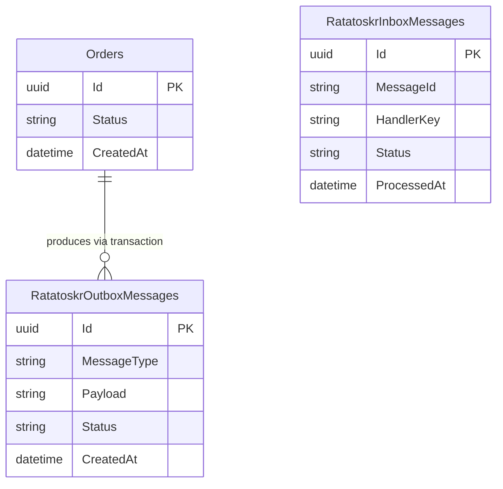

# feat: Expand Examples with Multi-Service E-Commerce Playground

## Enhancement Summary

**Deepened on:** 2026-04-25
**Research agents used:** architecture-strategist, data-integrity-guardian, performance-oracle, security-sentinel, julik-frontend-races-reviewer, best-practices-researcher (×3), code-simplicity-reviewer, spec-flow-analyzer

### Critical Blockers Discovered

1. **`MapRatatoskrManagementApi` requires a named auth policy** — the library throws `InvalidOperationException` at startup without one. Every service must register a permissive allow-all policy for local dev.
2. **CORS is a functional blocker** — Dashboard JS makes cross-origin requests to service management APIs. Without explicit CORS configuration in each service, all browser-side polling fails silently.
3. **Outbox relay default polling interval is 60 seconds** — must be overridden to ~2s or the demo appears broken.

### Key Improvements Over Original Plan

1. Added permissive auth policy pattern for management API (mandatory, not optional)
2. Added CORS configuration to OrderService and InventoryService
3. Changed failure mode from `static bool` to DI-registered singleton (`FailureModeState`)
4. Added explicit fan-out queue topology specification
5. Added `WithPollingInterval(2s)` on outbox relay
6. Added `ServiceDefaults` project pattern (Aspire standard — OTEL, health checks)
7. Added readiness probes for `WaitFor` to gate on app readiness, not just process start
8. Added two-step Dashboard UX for the failure mode demo
9. Specified JS race-condition guards for Dashboard polling
10. Flagged InventoryService publish-without-outbox as an intentional documented trade-off

### New Considerations Discovered

- InventoryService publishing `OrderFulfilled` via `PublishDirectAsync` (no outbox) creates a silent loss window — documented explicitly in the plan
- Requeue while failure mode is ON causes infinite re-poisoning — need UI guard in Dashboard
- `PlaygroundMessages` shared project: code-simplicity review flagged it as YAGNI; kept because brainstorm explicitly decided shared contracts should be visible in one place
- Fan-out correctness depends on each consumer having its own queue — not automatic

---

## Overview

Replace the single-service `PlaygroundApi` with a realistic e-commerce messaging scenario that spans three services and a consolidated dashboard. The goal is to make every significant Ratatoskr feature observable and triggerable from one place, so manual testing and demos are fast and self-explanatory.

The scenario models a simplified order pipeline: **OrderService** creates orders and starts message flows, **InventoryService** processes them (and can be made to fail), and **NotificationService** reacts to events independently. A separate **Dashboard** app provides a single HTML page to trigger flows and observe the state of all services.

## Problem Statement

The current `PlaygroundApi` is a single-service demo that covers only a subset of Ratatoskr features. Developers and demo audiences must read the code to understand what is happening, and there is no easy way to trigger retries, dead-lettering, or inbox deduplication without manual curl commands. The example does not reflect the multi-service fan-out and command-routing scenarios that are the core value proposition of the library.

## Proposed Solution

Five projects under `examples/`:

| Project | Role |
|---|---|
| `PlaygroundMessages` | Shared message contracts (new class library) |
| `OrderService` | Replaces `PlaygroundApi` — outbox, direct publish, commands |
| `InventoryService` | Command consumer, failure mode toggle, inbox dedup |
| `NotificationService` | Lightweight fan-out consumer, in-memory only |
| `Dashboard` | Single-page HTML app polling all management APIs |

`AppHost` is extended to orchestrate all four runnable projects with separate PostgreSQL databases and a shared RabbitMQ instance.

## Feature Coverage

(see brainstorm: docs/brainstorms/2026-04-25-expanded-examples-brainstorm.md)

| Feature | Where |
|---|---|
| Outbox (EF Core) | OrderService |
| Direct publish (no outbox) | OrderService |
| `[RatatoskrMessage]` attribute | `OrderPlaced`, `ProcessOrderCommand`, etc. |
| `MessageProperties` at call site | OrderService custom send |
| Event publish + consume | `OrderPlaced`, `OrderFulfilled`, `OrderFailed` |
| Command send + consume | `ProcessOrderCommand` |
| Multi-service fan-out | `OrderPlaced` → InventoryService + NotificationService |
| Retry + dead-lettering | InventoryService failure mode |
| Inbox deduplication | InventoryService (Dashboard sends duplicate message IDs) |
| Management API + requeue | All services, surfaced in Dashboard |
| RabbitMQ transport | All services |
| EF Core transport | OrderService, InventoryService |

## Technical Approach

### Architecture

```
examples/
  AppHost/              (extended — adds ServiceDefaults, 3 new services, 2 databases)
  ServiceDefaults/      (new — standard Aspire pattern: OTEL, health checks, service discovery)
  PlaygroundMessages/   (new — shared message contracts)
  OrderService/         (replaces PlaygroundApi)
  InventoryService/     (new)
  NotificationService/  (new)
  Dashboard/            (new — thin ASP.NET Core + single HTML page)
  Docs/                 (unchanged — documentation code snippets)
```

AppHost provisions:
- `postgres` server with two named databases: `ordersdb`, `inventorydb`
- `rabbitmq` with management plugin (existing)
- Four project resources: OrderService, InventoryService, NotificationService, Dashboard
- Dashboard receives service management URLs via `WithEnvironment` + `GetEndpoint`

### Research Insights — Architecture

**CORS is a functional blocker for the Dashboard.** The Dashboard JS makes cross-origin requests from its own Aspire port to each service's management API. Without CORS configuration in OrderService and InventoryService, all browser-side polling fails silently. Add to each service that has a management API:

```csharp
// In Program.cs of OrderService and InventoryService
builder.Services.AddCors(o => o.AddPolicy("LocalDashboard",
    p => p.AllowAnyOrigin().AllowAnyMethod().AllowAnyHeader()));
// Comment: AllowAnyOrigin is intentional for a local dev example only.
// Gate behind app.Environment.IsDevelopment() before any deployment.
app.UseCors("LocalDashboard");
```

**InventoryService publishes `OrderFulfilled` via `PublishDirectAsync` (no outbox).** This creates a loss window: if InventoryService publishes successfully but crashes before the inbox handler status is marked complete, the inbox processor retries — but the next attempt also calls `PublishDirectAsync`, resulting in a duplicate `OrderFulfilled` delivery. OrderService's inbox deduplicates by `(MessageId, HandlerKey)`, so this is safe only if the same CloudEvents id is used on retry. Alternatively, give InventoryService an outbox on `inventorydb` so the publish is transactional. This is a deliberate trade-off: the example keeps InventoryService simpler at the cost of a small undocumented loss window. **Add a comment in `ProcessOrderHandler` explaining this.**

**NotificationService has no management API endpoints the Dashboard can poll** (no EF Core context). Remove `Dashboard.WithReference(notificationService)` from AppHost — the reference is vestigial. If you want to surface NotificationService state, add a minimal health endpoint returning the last-notification timestamp.

**Fan-out correctness depends on separate queues per consumer.** Both InventoryService and NotificationService subscribe to `OrderPlaced`, but they must have separate RabbitMQ queues bound to the same topic exchange. Ratatoskr's `AddEventConsumeChannel` declares the consumer's own queue and binds it — this works correctly as long as queue names are unique across services. The DLQ topology (`inventory.order-placed.dlq` and `notification.order-placed.dlq`) is also independent per service.

**Start consumers before publishers to avoid silent message loss.** If OrderService publishes `OrderPlaced` before InventoryService has declared its queue binding, the broker drops the message silently (no queue bound to the exchange at publish time). Aspire's `WaitFor` ordering handles this: OrderService waits on the infrastructure but not on the other services. To guarantee consumers are ready first, add explicit `WaitFor(inventoryService)` on OrderService in AppHost.

### Domain Model



OrderService has one domain table (`Orders`). InventoryService has no domain tables — it uses the Ratatoskr inbox table for deduplication only.

### Handler Keys

Handler keys must be stable — they are persisted in the inbox database. Define them as constants in `PlaygroundMessages`:

```csharp
// PlaygroundMessages/HandlerKeys.cs
public static class HandlerKeys
{
    public const string InventoryProcessOrder = "inventory-process-order";
    public const string OrderFulfilled        = "order-fulfilled";
    public const string OrderFailed           = "order-failed";
    public const string NotifyOrderPlaced     = "notify-order-placed";
    public const string NotifyOrderFulfilled  = "notify-order-fulfilled";
}
```

**Note on `PlaygroundMessages` as a shared project:** A code-simplicity review flagged this as potentially premature — handler keys and message types could live inline in each service. Kept because the brainstorm explicitly decided shared contracts should be visible in one place, making the message contracts immediately apparent to example readers. (see brainstorm: docs/brainstorms/2026-04-25-expanded-examples-brainstorm.md)

### Implementation Phases

#### Phase 1: ServiceDefaults + PlaygroundMessages

**ServiceDefaults** (Aspire standard pattern):
- Create `examples/ServiceDefaults/ServiceDefaults.csproj`
- `AddServiceDefaults()` extension method: registers OTEL, health checks at `/health` and `/health/ready`, `ServiceDiscovery` client middleware
- All four service projects call `builder.AddServiceDefaults()` in `Program.cs`
- This is what makes Aspire service name resolution (`https+http://orderservice`) work automatically

**PlaygroundMessages**:
- Create `examples/PlaygroundMessages/PlaygroundMessages.csproj` (class library, `net10.0`)
- Add `PackageReference` to `Ratatoskr` (for `[RatatoskrMessage]`)
- Define message types:
  - `OrderPlaced` — `[RatatoskrMessage("ecommerce.order.placed")]`
  - `OrderFulfilled` — `[RatatoskrMessage("ecommerce.order.fulfilled")]`
  - `OrderFailed` — `[RatatoskrMessage("ecommerce.order.failed")]`
  - `ProcessOrderCommand` — `[RatatoskrMessage("ecommerce.inventory.process")]`
- Define `HandlerKeys` constants class

#### Phase 2: OrderService

Replace `PlaygroundApi` (keep as reference until confirmed working, then delete).

Key files:
- `OrderService/Program.cs` — see management API auth pattern below
- `OrderService/Database/OrdersDbContext.cs` — implements `IOutboxDbContext`, calls `modelBuilder.AddRatatoskrEfCoreModel`, `options.RegisterOutbox<OrdersDbContext>(sp)` in `AddDbContext`
- `OrderService/Database/Entities/Order.cs` — `Id` (Guid), `Status` (enum: Placed/Fulfilled/Failed), `CreatedAt`
- `OrderService/Handlers/OrderFulfilledHandler.cs` — updates order status to Fulfilled
- `OrderService/Handlers/OrderFailedHandler.cs` — updates order status to Failed

**Management API auth (mandatory):**

```csharp
// OrderService/Program.cs
builder.Services.AddAuthorization(o =>
    // DevOnlyNoAuth: permissive policy for local development example only.
    // Remove or replace before any deployment.
    o.AddPolicy("DevOnlyNoAuth", p => p.RequireAssertion(_ => true)));

// ...
app.UseAuthentication();
app.UseAuthorization();
app.MapRatatoskrManagementApi("DevOnlyNoAuth");
```

`MapRatatoskrManagementApi` throws `InvalidOperationException` at startup if the named policy does not exist. This pattern is mandatory.

HTTP endpoints (minimal API):
- `POST /api/orders` — creates `Order`, adds `OrderPlaced` to outbox (EF Core transaction), returns order ID
- `POST /api/orders/direct` — publishes `OrderPlaced` via `IRatatoskr.PublishDirectAsync` (no outbox)
- `POST /api/orders/{id}/replay` — re-publishes existing `OrderPlaced` with same message ID (inbox dedup demo)
- `GET /api/orders` — lists recent orders and their status

RabbitMQ channels:
- Publish `OrderPlaced` via topic exchange
- Publish `ProcessOrderCommand` via direct exchange to InventoryService
- Consume `OrderFulfilled` and `OrderFailed` events with inbox (EF Core)

**Outbox relay polling (mandatory for demo ergonomics):**

```csharp
bus.AddEfCoreDurability<OrdersDbContext>(d =>
{
    d.UseOutbox(o => o.WithPollingInterval(TimeSpan.FromSeconds(2)));
    d.UseInbox();
});
```

The default is 60 seconds — the outbox trigger fires immediately on `SaveChanges`, but the fallback polling must be short for crash-recovery scenarios to be visible in a demo.

#### Phase 3: InventoryService

Key files:
- `InventoryService/Program.cs`
- `InventoryService/Database/InventoryDbContext.cs` — implements `IInboxDbContext` only
- `InventoryService/Handlers/ProcessOrderHandler.cs` — checks failure flag, publishes `OrderFulfilled` or `OrderFailed`
- `InventoryService/FailureModeState.cs` — DI singleton (not static field)

**Failure mode as DI singleton (not static bool):**

```csharp
// InventoryService/FailureModeState.cs
public sealed class FailureModeState
{
    private volatile bool _enabled;
    public bool IsEnabled => _enabled;
    public void Toggle() => _enabled = !_enabled;
}

// In Program.cs
builder.Services.AddSingleton<FailureModeState>();
```

A DI singleton avoids static state contamination between test runs and is injectable into both the handler and the HTTP endpoint. The `volatile` keyword prevents register-caching of the bool value across handler threads (required for concurrent consumers — see PR #66).

HTTP endpoints:
- `POST /api/inventory/failure-mode` — calls `failureModeState.Toggle()`, returns current state
- `GET /api/inventory/failure-mode` — returns current state

**Note:** These endpoints have no auth, which is intentional for a local dev example. Add a comment: `// Dev-only endpoint — remove before deployment.`

Processing logic in `ProcessOrderHandler`:
1. If `failureModeState.IsEnabled` → throw exception (triggers retry/DLQ)
2. Else → publish `OrderFulfilled` via `IRatatoskr.PublishDirectAsync`

**Note on publish durability:** `ProcessOrderHandler` publishes `OrderFulfilled` without an outbox. There is a small loss window: if the process crashes between publishing and marking the inbox handler status complete, the inbox processor retries the handler, which publishes again with a new CloudEvents id. OrderService's inbox will treat this as a new message and process it. For an educational example this is an acceptable trade-off — add a comment in `ProcessOrderHandler` explaining it.

Retry config: `.WithRetry(maxRetries: 3, delay: TimeSpan.FromSeconds(5))` — the library default is 30s; 5s is better for demo pacing. Add a comment: `// Default is 30s. Short delay for demo visibility.`

Inbox retention (prevents table growth in long-running demos):

```csharp
bus.AddEfCoreDurability<InventoryDbContext>(d =>
    d.UseInbox(o =>
        o.WithRetentionPeriod(TimeSpan.FromMinutes(30))
         .WithCleanupInterval(TimeSpan.FromMinutes(5))));
```

#### Phase 4: NotificationService

Lightweight — no EF Core, no persistence.

Key files:
- `NotificationService/Program.cs` — `AddRatatoskr`, no EF Core durability
- `NotificationService/Handlers/OrderPlacedNotificationHandler.cs` — `ILogger.LogInformation`
- `NotificationService/Handlers/OrderFulfilledNotificationHandler.cs` — `ILogger.LogInformation`

No inbox deduplication (in-memory only, acceptable for a logging-only consumer). Handler keys still defined in `HandlerKeys` for consistency.

**Fan-out note:** Because NotificationService has no inbox, if the Dashboard replays an `OrderPlaced` message (same message ID), NotificationService will process it again. This is intentional and should be documented as the contrast: InventoryService deduplicates, NotificationService does not.

No management API (no EF Core context, so only RabbitMQ health would be available). The Dashboard does not poll NotificationService state.

#### Phase 5: Dashboard

Key files:
- `Dashboard/Program.cs` — `app.MapStaticAssets()`, `app.MapGet("/api/config", ...)` to expose service management URLs as JSON
- `Dashboard/wwwroot/index.html` — single-page app, `<script type="module">`

**Service URL injection in AppHost:**

```csharp
var dashboard = builder.AddProject<Projects.Dashboard>("dashboard")
    .WithReference(orderSvc)
    .WithReference(inventorySvc)
    .WithEnvironment("OrderService__ManagementUrl",
        orderSvc.GetEndpoint("https"))
    .WithEnvironment("InventoryService__ManagementUrl",
        inventorySvc.GetEndpoint("https"))
    .WaitFor(orderSvc)
    .WaitFor(inventorySvc)
    .WaitFor(notificationSvc);
```

`GetEndpoint("https")` is resolved at runtime — safe to call before ports are bound.

The Dashboard backend reads these env vars and exposes them via `GET /api/config` as JSON:
```json
{
  "orderServiceUrl": "https://localhost:7001",
  "inventoryServiceUrl": "https://localhost:7002"
}
```

**JavaScript architecture (`type="module"`, no build step):**

Use clear module separation inside a single `<script type="module">`:

```js
// --- State (single source of truth) ---
const state = {
  services: null, // populated after /api/config
  panels: {
    'order-outbox':    { count: null, error: null, stale: false },
    'order-inbox':     { count: null, error: null, stale: false },
    'inventory-inbox': { count: null, error: null, stale: false },
    'inventory-poisoned': { count: null, error: null, stale: false },
  },
  requeueingIds: new Set(),
};

// --- Bootstrap: gate all polling behind /api/config ---
async function init() {
  const cfg = await fetch('/api/config').then(r => r.json());
  state.services = cfg;
  startPollers(cfg); // polling only starts after config arrives
}

// --- Polling: recursive setTimeout, never setInterval ---
function startPoller(key, url) {
  (async function tick() {
    await fetchPanel(key, url);
    setTimeout(tick, 3000); // next tick always waits for previous to finish
  })();
}

async function fetchPanel(key, url) {
  try {
    const res = await fetch(url, { signal: AbortSignal.timeout(5000) });
    if (!res.ok) throw new Error(`HTTP ${res.status}`);
    const data = await res.json();
    updatePanel(key, {
      count: data.totalCount,
      error: null,
      stale: false,
    });
  } catch (err) {
    // Keep last known count visible (do not clear to '--')
    updatePanel(key, { error: err.message, stale: true });
  }
}
```

**Race condition guards:**

```js
// Prevent stale count after requeue: track in-flight requeue IDs
async function requeue(svcUrl, id) {
  if (state.requeueingIds.has(id)) return; // prevent double-click
  state.requeueingIds.add(id);
  try {
    await fetch(`${svcUrl}/ratatoskr/.../inbox/${id}/requeue`, { method: 'POST' });
    // Optimistic removal from local state — poll will confirm
    removeFromPanel('inventory-poisoned', id);
  } catch (e) {
    showError('inventory-poisoned', e.message);
  } finally {
    state.requeueingIds.delete(id);
  }
}

// In renderPanel: skip rendering IDs that are being requeued
function renderPanel(key) {
  const s = state.panels[key];
  const visible = (s.items ?? []).filter(m => !state.requeueingIds.has(m.id));
  // ... render visible items only
}
```

**Destructive action UX (two-step armed button):**

```js
function makeArmedButton(btn, action) {
  let armed = false, resetTimer;
  btn.addEventListener('click', () => {
    if (!armed) {
      armed = true;
      btn.dataset.label = btn.textContent;
      btn.textContent = 'Click again to confirm';
      btn.classList.add('btn--armed');
      resetTimer = setTimeout(() => {
        armed = false;
        btn.textContent = btn.dataset.label;
        btn.classList.remove('btn--armed');
      }, 3000);
    } else {
      clearTimeout(resetTimer);
      armed = false;
      btn.textContent = btn.dataset.label;
      btn.classList.remove('btn--armed');
      action();
    }
  });
}
```

Apply to: Toggle Failure Mode, Requeue.

**Stale data visual pattern:**

When a service is unreachable, keep the last known count visible and dim the panel:
```html
<section class="panel" aria-labelledby="inventory-heading">
  <h2 id="inventory-heading">InventoryService</h2>
  <div aria-live="polite" aria-atomic="true">
    <span class="count-value">--</span>
    <span class="stale-badge" hidden>stale</span>
  </div>
  <div role="alert" class="error-msg" hidden></div>
</section>
```

**Requeue-while-failure-mode-ON guard:**

```js
function renderRequeueButton(btn, failureModeActive) {
  btn.disabled = failureModeActive;
  btn.title = failureModeActive
    ? 'Disable failure mode before requeuing — otherwise the handler will fail again'
    : '';
}
```

This prevents the infinite loop (enable failure mode → requeue → re-poison → requeue → ...).

**Dashboard demo sequence for failure flow:**

Show a numbered instruction panel in the UI:
1. Click "Toggle Failure Mode ON"
2. Click "Place Order"
3. Wait ~15s for retries to exhaust (3 × 5s)
4. Click "Toggle Failure Mode OFF"
5. Click "Requeue" on the poisoned message

#### Phase 6: AppHost Extension

Complete `AppHost/Program.cs`:

```csharp
var postgres = builder.AddPostgres("postgres")
    .WithPgAdmin()
    .WithDataVolume("postgres-ceb");

var ordersDb    = postgres.AddDatabase("ordersdb");
var inventoryDb = postgres.AddDatabase("inventorydb");

var rabbitmq = builder.AddRabbitMQ("rabbitmq")
    .WithManagementPlugin()
    .WithDataVolume("rabbitmq-ceb");

var notificationSvc = builder.AddProject<Projects.NotificationService>("notificationservice")
    .WithReference(rabbitmq).WaitFor(rabbitmq);

var inventorySvc = builder.AddProject<Projects.InventoryService>("inventoryservice")
    .WithReference(inventoryDb).WaitFor(inventoryDb)
    .WithReference(rabbitmq).WaitFor(rabbitmq)
    .WithHttpProbe(ProbeType.Readiness, "/health/ready");

var orderSvc = builder.AddProject<Projects.OrderService>("orderservice")
    .WithReference(ordersDb).WaitFor(ordersDb)
    .WithReference(rabbitmq).WaitFor(rabbitmq)
    // Wait for consumers to declare queue bindings before publishing
    .WaitFor(inventorySvc)
    .WaitFor(notificationSvc)
    .WithHttpProbe(ProbeType.Readiness, "/health/ready");

var dashboard = builder.AddProject<Projects.Dashboard>("dashboard")
    .WithReference(orderSvc)
    .WithReference(inventorySvc)
    .WithEnvironment("OrderService__ManagementUrl", orderSvc.GetEndpoint("https"))
    .WithEnvironment("InventoryService__ManagementUrl", inventorySvc.GetEndpoint("https"))
    .WaitFor(orderSvc)
    .WaitFor(inventorySvc)
    .WaitFor(notificationSvc);
```

**Why `WaitFor(inventorySvc)` on OrderService:** If OrderService publishes before InventoryService has declared its queue binding, the broker silently drops the message. The `WaitFor` + readiness probe ensures InventoryService is fully ready (queue declared) before OrderService accepts traffic.

Remove `PlaygroundApi` from AppHost once OrderService is working.

## Alternative Approaches Considered

(see brainstorm: docs/brainstorms/2026-04-25-expanded-examples-brainstorm.md)

- **Keep PlaygroundApi, add services alongside** — rejected; would double the example surface area without improving cohesion.
- **React/Vue dashboard** — rejected; framework overhead is not justified for a dev-tools page.
- **Single shared database** — rejected; does not reflect realistic microservices boundaries.
- **Merging InventoryService + NotificationService** — considered during simplicity review. Kept separate because the fan-out demo requires visibly independent services with separate queues and separate DLQ topologies.
- **Replace failure mode with `X-Force-Failure` request header** — considered (cleaner, no state). Kept as toggle because the Dashboard needs a persistent on/off state that survives across multiple order placements during a live demo.

## System-Wide Impact

### Interaction Graph

Placing an order via outbox:
1. `POST /api/orders` → `OrdersDbContext.SaveChangesAsync` → outbox interceptor writes `RatatoskrOutboxMessage` in same transaction
2. Outbox interceptor trigger fires immediately → outbox relay publishes `OrderPlaced` to RabbitMQ topic exchange within ~1s
3. InventoryService and NotificationService each receive `OrderPlaced` from their own queue (independent fan-out)
4. InventoryService `ProcessOrderHandler` executes → inbox row written → publishes `OrderFulfilled` via `PublishDirectAsync`
5. NotificationService `OrderPlacedNotificationHandler` logs — no inbox, no dedup
6. OrderService RabbitMQ consumer receives `OrderFulfilled` → `OrderFulfilledHandler` → updates `Order.Status = Fulfilled`

### Error and Failure Propagation

- If `ProcessOrderHandler` throws: RabbitMQ retries 3× with 5s delay; after exhaustion, `InboxHandlerStatusEntity.IsPoisoned = true` → appears in `inbox/poisoned`
- Dashboard shows poisoned count (auto-refreshes every 3s); user: (1) disable failure mode, (2) click Requeue → `IsPoisoned = false, ErrorCount = 0` → inbox processor picks up again
- If outbox relay fails (e.g., RabbitMQ down): message stays in `outbox` with `Pending` status; no data loss; relay retries on next poll cycle
- If InventoryService publishes `OrderFulfilled` but crashes before completing inbox handler: inbox processor retries the handler, which calls `PublishDirectAsync` again with a new message ID — OrderService inbox treats it as a new message and processes it (order status updated twice, second update is a no-op since status is already Fulfilled)

### State Lifecycle Risks

- **`OrderPlaced` replay with same message ID:** InventoryService deduplicates (inbox constraint fires) — handler not invoked. NotificationService processes it again (no inbox). OrderService does not dedup the publish itself. Documented as intentional contrast.
- **Failure mode toggle:** In-memory `FailureModeState` singleton resets to `false` on service restart. This is intentional for a local dev example.
- **Requeue while failure mode ON:** Causes re-poisoning after 3 retries. Dashboard disables the Requeue button when failure mode is active.
- **Inbox replay TTL:** `InboxMessageEntity` rows are permanent until explicitly deleted (management API bulk delete). A replay with the same message ID sent after a successful original delivery will be silently dropped — this is the correct behavior for the dedup demo.

### API Surface Parity

The Dashboard calls management API paths containing the DbContext name as a route segment. The exact segment is derived from the registered DbContext type name by `EfCoreEndpointConfigurator`. Verify the exact segment during implementation and pin it in the Dashboard's `/api/config` response rather than hardcoding it in JavaScript:

```json
{
  "orderServiceUrl": "https://localhost:7001",
  "orderContextPath": "ratatoskr/efcore/contexts/OrdersDbContext",
  "inventoryServiceUrl": "https://localhost:7002",
  "inventoryContextPath": "ratatoskr/efcore/contexts/InventoryDbContext"
}
```

### Integration Test Scenarios

1. Place order (outbox) → verify `OrderPlaced` received by both InventoryService AND NotificationService (fan-out)
2. Enable failure mode → place order → verify message appears in `inbox/poisoned` after 3 retries → disable failure mode → requeue → verify `Order.Status = Fulfilled`
3. Place order → replay with same message ID → verify InventoryService processes exactly once (inbox dedup) → verify NotificationService processes twice (no dedup)
4. Place order (direct) → verify no outbox row created, `OrderPlaced` delivered immediately
5. Dashboard polls management API → verify poisoned count updates within 5 seconds of failure

## Acceptance Criteria

### Functional

- [ ] `dotnet run --project examples/AppHost` starts all four services, PostgreSQL, and RabbitMQ with no manual setup
- [ ] Dashboard is accessible at the Aspire dashboard URL and shows OrderService and InventoryService panels
- [ ] Clicking "Place Order (Outbox)" → order appears in OrderService with status `Placed`, then transitions to `Fulfilled`
- [ ] Clicking "Place Order (Direct)" → order processed without an outbox row
- [ ] Clicking "Send Replay" → InventoryService processes the original message ID exactly once; NotificationService logs twice
- [ ] Enabling failure mode and placing an order → message appears in InventoryService poisoned inbox
- [ ] Requeue button is disabled when failure mode is ON; tooltip explains why
- [ ] Disabling failure mode then clicking Requeue → message reprocessed successfully
- [ ] NotificationService logs both `OrderPlaced` and `OrderFulfilled` for each successful order
- [ ] Dashboard state panels auto-refresh every 3 seconds via recursive setTimeout
- [ ] Dashboard shows stale state (dimmed panel + badge) when a service is unreachable
- [ ] `PlaygroundApi` project is removed from `examples/` and `AppHost`

### Non-Functional

- [ ] Each service has its own PostgreSQL database (ordersdb, inventorydb)
- [ ] Handler keys are defined as constants in `PlaygroundMessages/HandlerKeys.cs`
- [ ] All message types carry `[RatatoskrMessage]` attribute
- [ ] `MapRatatoskrManagementApi` called with `"DevOnlyNoAuth"` policy in all services that expose it
- [ ] CORS configured with `AllowAnyOrigin()` + `IsDevelopment()` guard in OrderService and InventoryService
- [ ] `FailureModeState` registered as DI singleton with `volatile bool` field
- [ ] `WithPollingInterval(TimeSpan.FromSeconds(2))` on OrderService outbox relay
- [ ] Inbox retention period set on InventoryService (30 minutes)
- [ ] Readiness probes configured on OrderService and InventoryService

### Tests

- [ ] Integration tests covering the five cross-layer scenarios listed above
- [ ] Tests live in the existing `tests/Ratatoskr.Tests` project under an `Examples/` subdirectory
- [ ] Tests verify inbox dedup by checking handler invocation count (once for InventoryService, twice for NotificationService)

## Dependencies and Prerequisites

- `Aspire.Hosting.Sdk 13.1.0` — already in AppHost
- `Ratatoskr` NuGet packages — reference same versions as existing PlaygroundApi
- No new external dependencies required

## Documentation Plan

- Update `docs/` to reference the new example structure (replace PlaygroundApi mentions)
- Add a short `examples/README.md` explaining the scenario, demo sequence, and how to run
- Feature Coverage Matrix in `docs/` if one exists pointing to examples
- Each service `Program.cs` should have a top-level comment: `// Local development example only. See examples/README.md.`

## Sources and References

### Origin

- **Brainstorm document:** [docs/brainstorms/2026-04-25-expanded-examples-brainstorm.md](../brainstorms/2026-04-25-expanded-examples-brainstorm.md)
  Key decisions carried forward: separate Dashboard project with vanilla JS, separate databases per service, failure mode toggle API, single `dotnet run` via AppHost

### Internal References

- Current AppHost: [examples/AppHost/Program.cs](../../examples/AppHost/Program.cs)
- PlaygroundApi pattern: [examples/PlaygroundApi/Program.cs](../../examples/PlaygroundApi/Program.cs)
- DbContext pattern: [examples/PlaygroundApi/Database/NotesDbContext.cs](../../examples/PlaygroundApi/Database/NotesDbContext.cs)
- Richest config example: [examples/Docs/Program.cs](../../examples/Docs/Program.cs)

### Related Work

- PR #66 — consumer concurrency option (relevant to `PrefetchCount` and `FailureModeState` thread safety)
- PR #69 — management API for poisoned messages (Dashboard requeue feature depends on this)
- PR #72 — OTEL trace linking (traces will flow across services in this example; ServiceDefaults wires this automatically)
