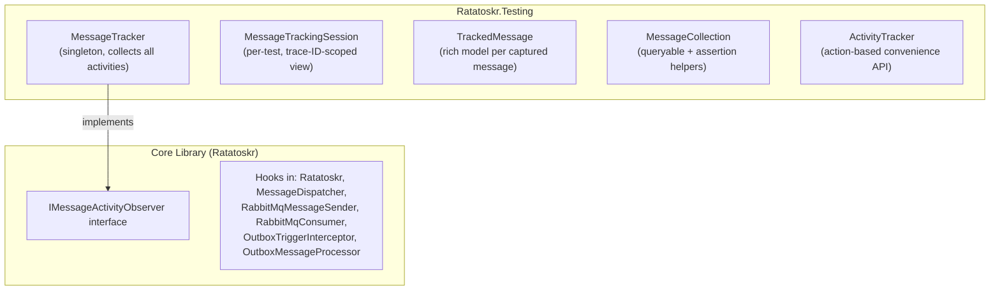

# Testing

Ratatoskr provides a dedicated testing package `Ratatoskr.Testing` that makes it easy to write high-confidence integration tests with full pipeline observability, parallel test isolation, and ergonomic assertion APIs.

## Setup

Install the `Ratatoskr.Testing` package and register it in your test setup:

```csharp
services.AddRatatoskrTesting();
```

This registers a `MessageTracker` singleton that observes all message activities flowing through the pipeline. In production (when not registered), there is zero overhead — the observer collection is simply empty.

## Pipeline Stages

The tracker captures messages at every stage of the pipeline:

| Stage | Description |
|:---|:---|
| `Published` | After `IRatatoskr.PublishDirectAsync` completes |
| `Sent` | After bytes are sent to the transport (e.g. RabbitMQ) |
| `Received` | When the consumer receives a message from the transport |
| `Dispatched` | After handler invocation completes (includes result and exception) |
| `OutboxStaged` | When a message is serialized into an outbox entity during `SaveChanges` |
| `OutboxSent` | When the outbox processor sends a message to the transport |

## Session-Based API

The primary API creates a `MessageTrackingSession` per test. Each session generates a unique W3C trace ID that correlates all messages published within its scope — enabling **parallel test isolation**.

```csharp
[Test]
public async Task OrderCreated_HandlerProcessesSuccessfully()
{
    // ... setup with AddRatatoskrTesting() ...

    await using var session = Services.CreateTrackingSession();

    // Publish within the session's trace context
    await InScopeAsync(async ctx =>
    {
        var bus = ctx.ServiceProvider.GetRequiredService<IRatatoskr>();
        await bus.PublishDirectAsync(new OrderCreatedEvent { OrderId = "123" });
    });

    // Wait for the handler to complete — returns the tracked message directly
    var dispatched = await session.WaitForDispatched<OrderCreatedEvent>();
    dispatched.GetMessage<OrderCreatedEvent>().OrderId.Should().Be("123");
    dispatched.Result.Should().Be(DispatchResult.Success);
}
```

### Creating a Session

```csharp
// From IServiceProvider
await using var session = services.CreateTrackingSession();

// From IHost
await using var session = host.CreateTrackingSession();

// With custom default timeout
await using var session = services.CreateTrackingSession(
    defaultTimeout: TimeSpan.FromSeconds(30));
```

### Waiting for Messages

Each wait method blocks until a matching message arrives or the timeout expires, and returns the `TrackedMessage` directly:

```csharp
var published = await session.WaitForPublished<OrderCreatedEvent>();
var sent = await session.WaitForSent<OrderCreatedEvent>();
var received = await session.WaitForReceived<OrderCreatedEvent>();
var dispatched = await session.WaitForDispatched<OrderCreatedEvent>();

// With custom timeout
var dispatched = await session.WaitForDispatched<OrderCreatedEvent>(
    TimeSpan.FromSeconds(15));

// With additional predicate
var dispatched = await session.WaitForDispatched<OrderCreatedEvent>(
    predicate: m => m.GetMessage<OrderCreatedEvent>().OrderId == "123");
```

Prefer using the return value directly over querying the collection afterward — this avoids race conditions where a later stage completes before an earlier stage's observer notification is recorded.

### Querying Messages

Each stage has a `MessageCollection` property for querying captured messages:

```csharp
// Get single message of type (throws if 0 or >1)
var msg = session.Dispatched.Single<OrderCreatedEvent>();

// Get first message of type
var msg = session.Dispatched.First<OrderCreatedEvent>();

// Get all messages of type
IReadOnlyList<TrackedMessage> all = session.Dispatched.All<OrderCreatedEvent>();

// Count
int count = session.Published.Count;
```

### Assertion Helpers

```csharp
// Assert at least one message of type exists (returns it)
var msg = session.Dispatched.ShouldHaveMessage<OrderCreatedEvent>();

// Assert no messages of type exist
session.Published.ShouldHaveNoMessage<OrderCancelledEvent>();
```

### TrackedMessage Properties

Each `TrackedMessage` provides rich access to the captured data:

```csharp
var msg = session.Dispatched.Single<OrderCreatedEvent>();

// Typed access to the deserialized message
OrderCreatedEvent order = msg.GetMessage<OrderCreatedEvent>();

// Message properties (CloudEvents metadata)
msg.Properties.Type    // "order.created"
msg.Properties.Id      // message ID
msg.Properties.Source  // source URI

// Dispatch result (only at Dispatched stage)
msg.Result             // DispatchResult.Success, RecoverableError, etc.

// Exception (if handler threw)
msg.Exception          // null on success

// Raw serialized bytes (exact wire format at Sent stage)
byte[] raw = msg.RawBody;

// Pipeline stage
msg.Stage              // MessageStage.Dispatched

// Trace ID for correlation
msg.TraceId            // W3C trace ID string
```

## Action-Based API

For simpler scenarios, the action-based API wraps session creation and waiting into a single call:

```csharp
[Test]
public async Task CreateOrder_PublishesEvent()
{
    // ... setup ...

    await using var session = await Services
        .TrackActivity()
        .Timeout(TimeSpan.FromSeconds(10))
        .WaitForMessage<OrderCreatedEvent>(MessageStage.Dispatched)
        .ExecuteAndWaitAsync(async () =>
        {
            using var scope = Services.CreateScope();
            var bus = scope.ServiceProvider.GetRequiredService<IRatatoskr>();
            await bus.PublishDirectAsync(new OrderCreatedEvent { OrderId = "123" });
        });

    // Assert
    session.Dispatched.Single<OrderCreatedEvent>()
        .Result.Should().Be(DispatchResult.Success);
}
```

### PublishAndWaitAsync

A convenience method that resolves `IRatatoskr` and publishes for you. It always waits for `MessageStage.Dispatched`:

```csharp
await using var session = await Services
    .TrackActivity()
    .PublishAndWaitAsync(new OrderCreatedEvent { OrderId = "123" });

session.Dispatched.ShouldHaveMessage<OrderCreatedEvent>();
```

> **Note:** `PublishAndWaitAsync` does not support custom `WaitForMessage` conditions. If you chain `WaitForMessage()` before calling `PublishAndWaitAsync`, it will throw an `InvalidOperationException`. Use `ExecuteAndWaitAsync` instead when you need custom wait conditions.

## Transport Wire Format Assertions

The `TransportMessage` property on `TrackedMessage` captures the transport-level wire representation of a message. It's available at the **Sent** stage (after envelope mapping) and the **Received** stage (before envelope mapping). This lets you verify transport-specific details like AMQP headers, CloudEvents attributes, and the raw wire body — catching bugs in envelope mappers that would be invisible through `MessageProperties` alone.

```csharp
await using var session = Services.CreateTrackingSession();

await InScopeAsync(async ctx =>
{
    var bus = ctx.ServiceProvider.GetRequiredService<IRatatoskr>();
    await bus.PublishDirectAsync(new OrderCreatedEvent { OrderId = "123" });
});

// Verify outgoing wire format
var sent = await session.WaitForSent<OrderCreatedEvent>();
var transport = sent.TransportMessage!;

// Assert on AMQP properties
transport.Headers["content-type"].Should().Be("application/json");
transport.Headers["type"].Should().Be("order.created");
transport.Headers["delivery-mode"].Should().Be(2); // Persistent

// Assert on CloudEvents AMQP headers (binary mode)
transport.Headers["cloudEvents_specversion"].Should().Be("1.0");
transport.Headers["cloudEvents_type"].Should().Be("order.created");

// Assert on the raw wire body
var wireBody = Encoding.UTF8.GetString(transport.Body);
wireBody.Should().Contain("123");

// Routing metadata (separate from protocol headers)
transport.Metadata["exchange"].Should().Be("orders-exchange");
transport.Metadata["routing-key"].Should().Be("order.created");
```

### Received stage

On the receive side, `TransportMessage` captures the raw data before the envelope mapper unwraps it. Delivery metadata is available via the `Metadata` dictionary:

```csharp
var received = await session.WaitForReceived<OrderCreatedEvent>();
var transport = received.TransportMessage!;

// Delivery metadata
transport.Metadata["exchange"].Should().Be("orders-exchange");
transport.Metadata["routing-key"].Should().Be("order.created");
transport.Metadata["redelivered"].Should().Be(false);

// Raw wire body (before envelope unwrapping)
transport.Body.Should().NotBeEmpty();
```

### Stage availability

| Stage | `TransportMessage` | Notes |
|:---|:---|:---|
| Published | `null` | No transport involved yet |
| **Sent** | **populated** | After envelope mapping — AMQP properties + wire body |
| OutboxStaged | `null` | No transport involved yet |
| OutboxSent | `null` | Transport details captured in the corresponding Sent activity |
| **Received** | **populated** | Before envelope mapping — raw AMQP delivery + wire body |
| Dispatched | `null` | No transport at this stage |

### Legacy: RawBody

The `RawBody` property on `TrackedMessage` still provides the serialized body bytes. At the `Sent` stage this happens to be the wire body, but `TransportMessage` is the preferred way to assert on wire format since it also includes the transport headers.

## Outbox Testing

The tracker captures outbox-specific stages, making it easy to verify the full outbox flow:

```csharp
await using var session = Services.CreateTrackingSession();

await InScopeAsync(async ctx =>
{
    var dbContext = ctx.ServiceProvider.GetRequiredService<MyDbContext>();
    dbContext.OutboxMessages.Add(
        new OrderCreatedEvent { OrderId = "123" },
        new MessageProperties().SetExchange("orders"));
    await dbContext.SaveChangesAsync();
});

var dispatched = await session.WaitForDispatched<OrderCreatedEvent>(
    TimeSpan.FromSeconds(10));
dispatched.Result.Should().Be(DispatchResult.Success);

// Verify it went through the outbox (OutboxStaged is synchronous during SaveChanges)
session.OutboxStaged.ShouldHaveMessage<OrderCreatedEvent>();
```

## Parallel Test Isolation

Each `MessageTrackingSession` creates a unique W3C trace ID. Messages published within a session inherit this trace ID through `Activity.Current`. The consumer propagates the trace ID via message headers. Sessions filter messages by matching trace ID, so **parallel tests never interfere with each other**.

```csharp
// Two sessions running concurrently see only their own messages
await using var session1 = Services.CreateTrackingSession();
// ... publish message A in session1's context ...

await using var session2 = Services.CreateTrackingSession();
// ... publish message B in session2's context ...

session1.Dispatched.Single<MyEvent>().GetMessage<MyEvent>().Id.Should().Be("A");
session2.Dispatched.Single<MyEvent>().GetMessage<MyEvent>().Id.Should().Be("B");

// Trace IDs are different
session1.TraceId.Should().NotBe(session2.TraceId);
```

## Architecture


